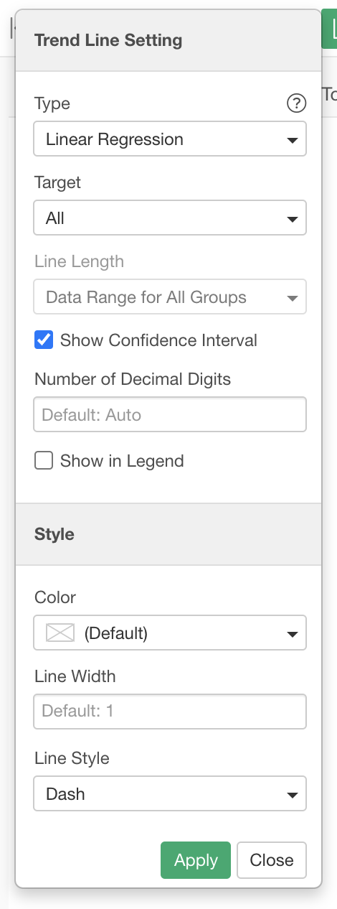
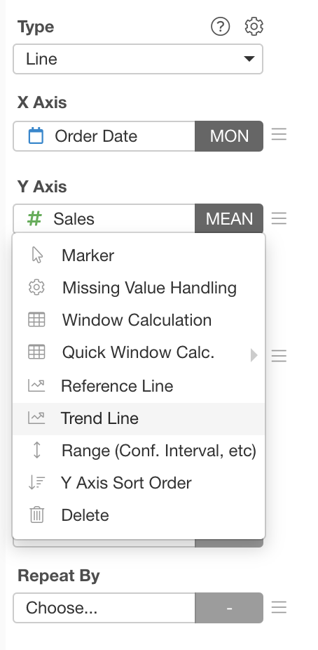
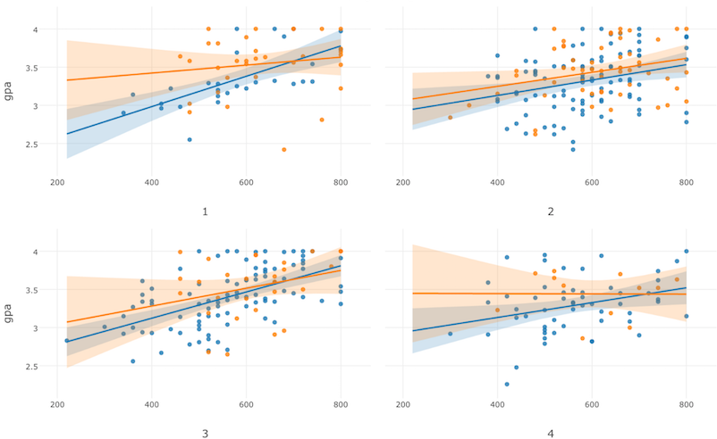
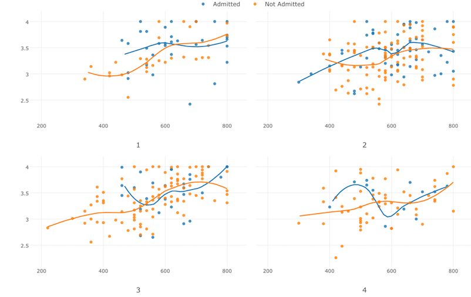
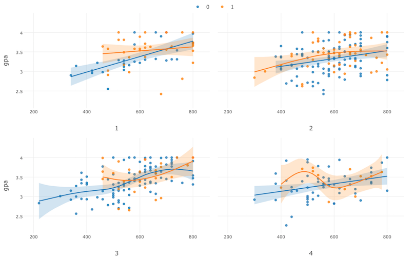
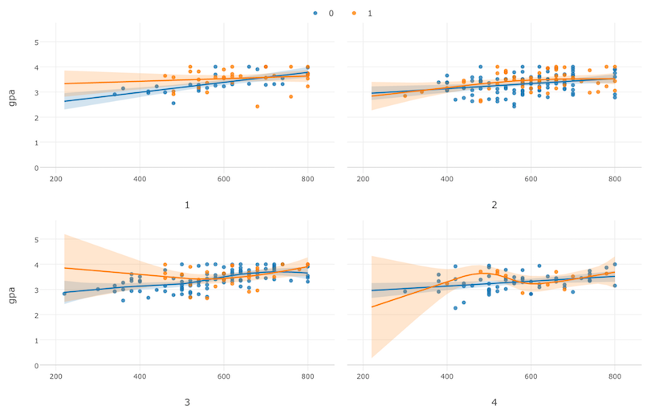

# Trend Line

Trend Line feature is available for Line and Scatter(No Aggregation and With Aggregation) charts. You can draw Trend or Smooth Lines by selecting one of the Trend Line types in the Trend Line Setting dialog. 

You can open this dialog by selecting the `Trend Line` menu of Y-Axis properties. 

## Type

We support the following Trend Line types.

### Linear Regression  —  LM

This one uses Linear Regression (lm) internally and draws linear (straight) lines.

### Polynomial  —  Loess

This one uses the Local Polynomial Regression (loess) internally to draw trend lines. It is best to use when the data size is small. This option will be automatically disabled if the data size is more than 1000 for performance reasons.  

### Polynomial  —  GAM

This one uses the Generalized Additive Model (GAM) internally to draw trend lines. It is the best to use when the data size is large.

### Logistic Regression

This one uses the Logistic Regression internally to draw trend lines. 

### Poisson Regression

This one uses the Poisson Regression internally to draw trend lines. 

## Target 

You can choose the target data group for the Trend Lines. It is available if you assign a column to Color.

* All: It draws a single Trend Line based on all data regardless of the Color setting. 
* Each Color Group: It draws Trend Lines for each color group. This is the default option.

## Line Length 

You can choose one of the following options for the Trend Line length. 

* Data Range for Each Group - It draws the trend lines and ranges only for the X-Axis range for each group of Color

* Data Range for All Groups - It draws the trend lines and ranges for the entire chart area.  

## Show Confidence Interval 

You can show/hide the confidence interval ranges. The default is "show".

## Show in Legend

If you select the "All" option for the Target, it shows a corresponding item in the legend. You can uncheck it to hide this.

