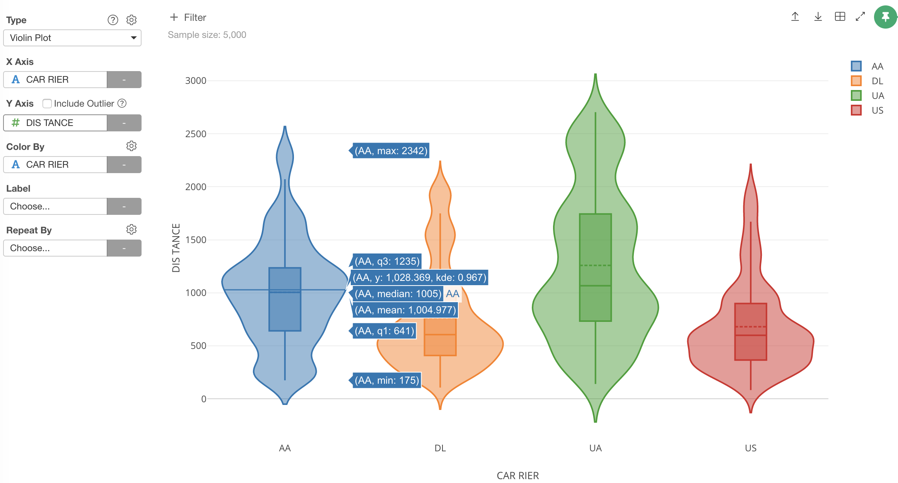
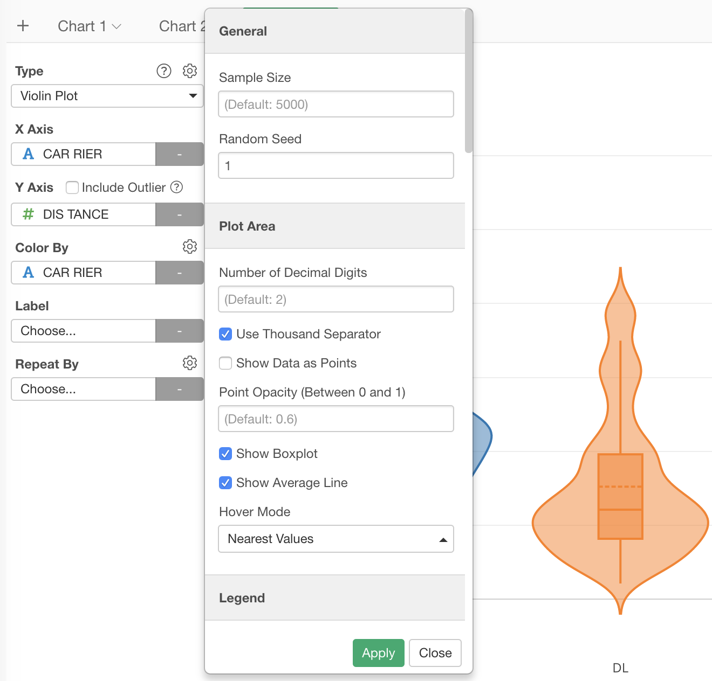
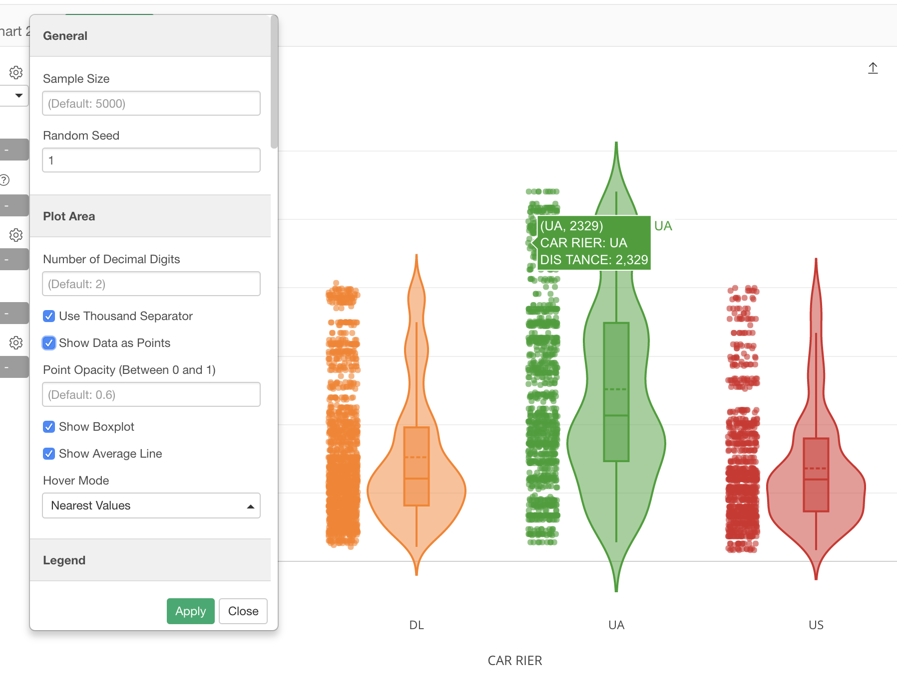

## Violin Chart

You can show the distribution of the data with "Violin" like shapes. This chart is a combination of Density Plot and Boxplot. 

## Column Assignments

* X-Axis - Assign a column you want to show the distribution. The column data should be numeric. 
* Color By - Assign a column for color. Take a look at [Color](color.md) section for more details.
* Repeat By - You can assign a column to repeat the chart for each of its values. Take a look at [Small Multiple](small-multiple.md) section for more details.
* Include Outlier - You can uncheck to exclude the outlier values. 

## Highlight 

You can change the color of the specific markers such as bars, lines or circles that you pick to stand out from others. See [Highlight](highlight.md) for the detail. 

## Category 

You can categorize numeric values inside the chart. See [Category(Binning)](category.md) for the detail.

## Limit Values

You can use Limit Values to filter the categories by the aggregated values. See [Limit Values](limit.md) for the detail.

## Layout Configuration

* Show Data as Points - You can plot the data by dots on the plot area. 

* Show Boxplot - You can show/hide the Boxplots inside the violins. 
* Show Average Line - You can show/hide the average lines inside the violins.

Take a look at [Layout Configuration](layout.md) on how to configure the layout and format. 
