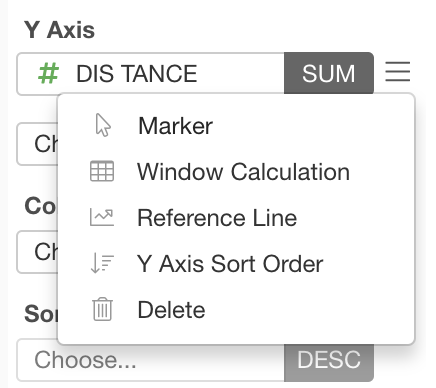

# Window (Table) Calculation 

The Window Calculation is available on Bar, Line and Area charts. You can set the Window Calculation from the Y-Axis properties.  

## Types

Following 5 Calculation Types are available. 

### Cumulative (Running Total)

The "Cumulative" calculation calculates the current value based on the previous values in each group. 

There are following options available for summarize values. The default value is `Sum`.

* Sum 
* Mean (Average)
* Min Value
* Max Value
* Product

### Percent (%) of Total

The "Percent of Total" calculates the ratio of values in each group. 

There are following 3 group by options available. Default is `X Axis`.

* X Axis - Calculate the ratio for each X Axis data point. The total percentages on each X value will be 100%.  
* Color - Calculate the ratio for each color value. The total percentage on each color value will be 100%. For example, in following chart, total percentatge of blue bars is 100%, and the same for other colors. 
* All - Calculate the ratio based on all data point. The total percentage of all the data point will be 100%.

### Difference From 

The "Difference From" calculates the difference from the specified position. There are following 4 options where you compare the different from. Default is `First`.

* First - Calculate the difference from the very first value. The first value will be always 0. 

* Last - Calculate the difference from the very last value. The last value will be always 0.

* previous - Calculate the difference from the previous value. 
* Next - Calculate the difference from the next value. 

### Percent (%) Difference From 

The "Percent (%) Difference From" calculates the difference ratio from the specified position. There are following 4 options where you compare the different from. Default is `First`.

* First - Calculate the difference from the very first value. The first value should be always 0. 

* Last - Calculate the difference from the very last value. The last value should be always 0.
* previous - Calculate the difference from the previous value. 
* Next - Calculate the difference from the next value. 

### Moving Calculation 

The "Moving Calculation" calculates values by summarizing the data points in the window (range) around each data point. 

For example, in this chart, it is using Moving Calculation using Average for summarizing data. Each data point is calculated by the average of the target data point plus 4 previous (left) data points. The beginning 4 data points which are on the very left of the chart are empty because there are not enough data points to calculate for those. 

Following options are available. 

* Summarize Values Using - Type of calculations to apply to data points in the window. The default is `Average`.
 * Average
 * Min Value
 * Max Value
 * Median 
 * Standard Deviation
 * Variance
 * Sum 
 * Product
* Window Size - Number of data points to include in each window. Default is 5.   
* Window Align - How to define the boundary of each window. For example, if you set `Right`, each window includes the target data point plus 4 left data points.    
 * Right
 * Center
 * Left
* Fill Value - Value to fill the empty data points. Default is empty. 

## Links

You can check out the following articles for more information. 

* [Introducing Window Calculations with Chart in Exploratory Desktop](https://blog.exploratory.io/introducing-window-calculations-in-exploratory-desktop-67cb19f77eb)

* [5 Most Practically Useful Window (Table) Calculations in R](https://blog.exploratory.io/5-most-practically-useful-window-table-calculations-in-r-7e2c7ca431d9)
