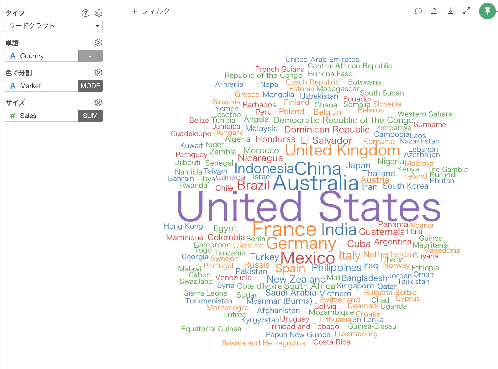
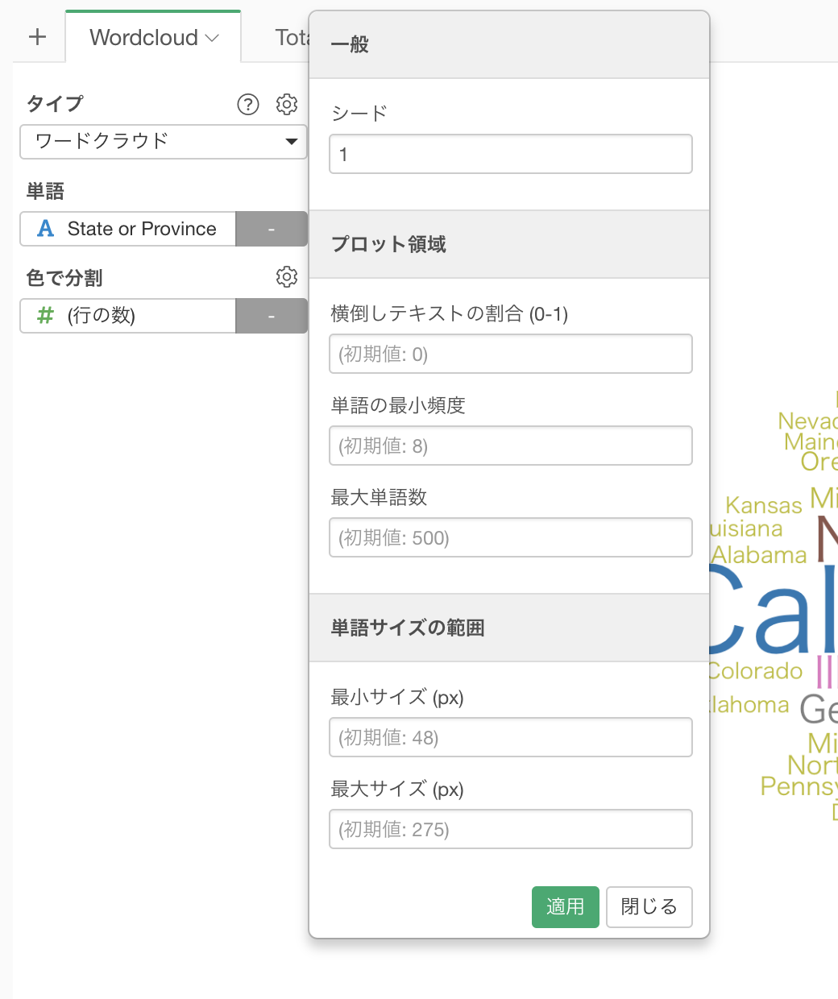

# ワード クラウド

## 列の割当

* 単語 - 表示したい単語を含む列を割り当てます。 
* 色で分割 - 単語の出現頻度を含む列を割り当てます。詳細は[Color](color.md)を参照してください。

## 設定

### 横倒しテキストの割合 (0-1)
単語を横倒し(90度回転)に表示する割合。例えば0.5と設定すると、半分は横倒し(90度回転)で表示されます。

### 単語の最小頻度
出現回数がこの最小頻度以下の単語は表示されません。

### 最大単語数
表示させる最大単語数。最大単語数に制限するために、頻度の少ない単語は除外されます。

### 文字サイズの範囲
単語の文字サイズ範囲。最小値と最大値を指定します。