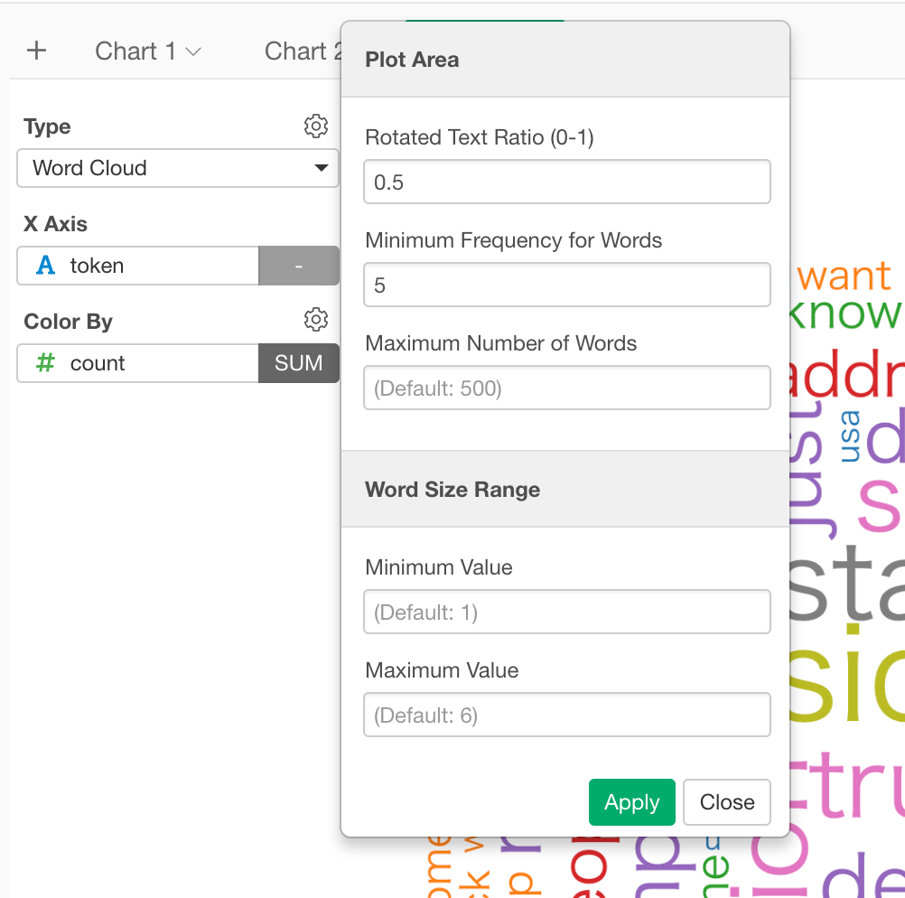

# Word Cloud

## Column Assignments

* X-Axis - Assign a column that contains words that you want to plot. 
* Color By - Assign a column that contains word frequency. Take a look at [Color](color.md) section for more details.

## Configuration

### Rotated Text Ratio (0-1)
This controls the ratio of words displayed vertically (90 degree rotation). For example, if you set 0.5 half of the words are displayed vertically.

### Minimum Frequency for Words
Words whose frequency is below this Minimum Frequency will not be plotted.

### Maximum Number of Words
Maximum number of words to be plotted. least frequent terms dropped

### Word Size Range
The range (between Minimum Value and Maximum Value) of the size of the words.