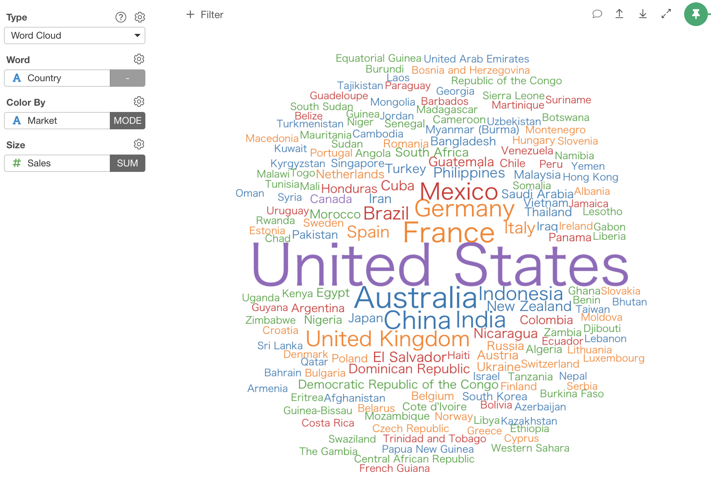
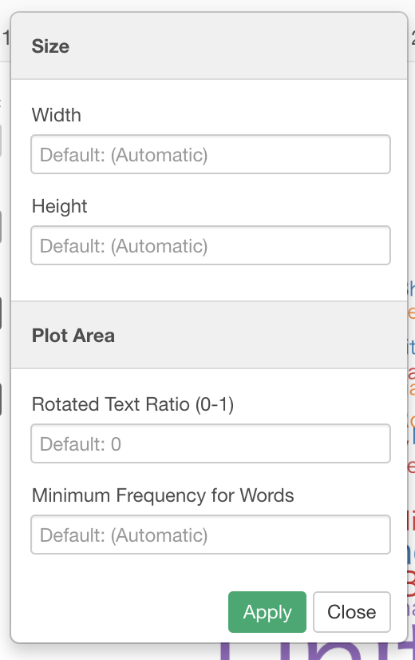

# Word Cloud

## Column Assignments

* Word - Assign a column that contains words that you want to plot. 
* Color By - Assign a column that contains word frequency. The values should be positive numeric values. It doesn't show words with 0 or negative values. Take a look at [Color](color.md) section for more details.

## Configuration

* Rotated Text Ratio (0-1) - This controls the ratio of words displayed vertically (90 degree rotation). For example, if you set 0.5 half of the words are displayed vertically.
* Min Frequency for Words - Words whose frequency is below this Minimum Frequency will not be plotted.
* Max Number of Words - Maximum number of words to be plotted. least frequent terms dropped
* Word Size Range - You can set the minimum and maximum size of the word size. Note that this is not a font size, but the size of the "word". 
