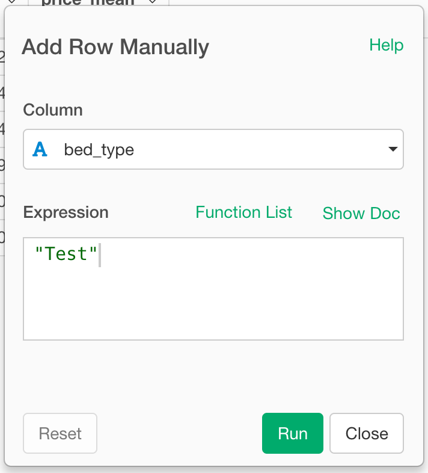

# Add Row

You can add a row by passing Column Name-value pairs.

## How to Access This Feature
* Click "+" button and select "Others ..." -> "Add Row Manually"

### Add Row Manually

1. Select Column that you want to set a value.
2. Enter a value for the column in the Expression field.
3. Click "Run" to Sample data frame.

If you want to enter values for the other columns in the row, you can click "+Add New" on the "Add Row Manually" step.

Then repeat the same for the other columns, and you can add a row like the below screenshot. 

