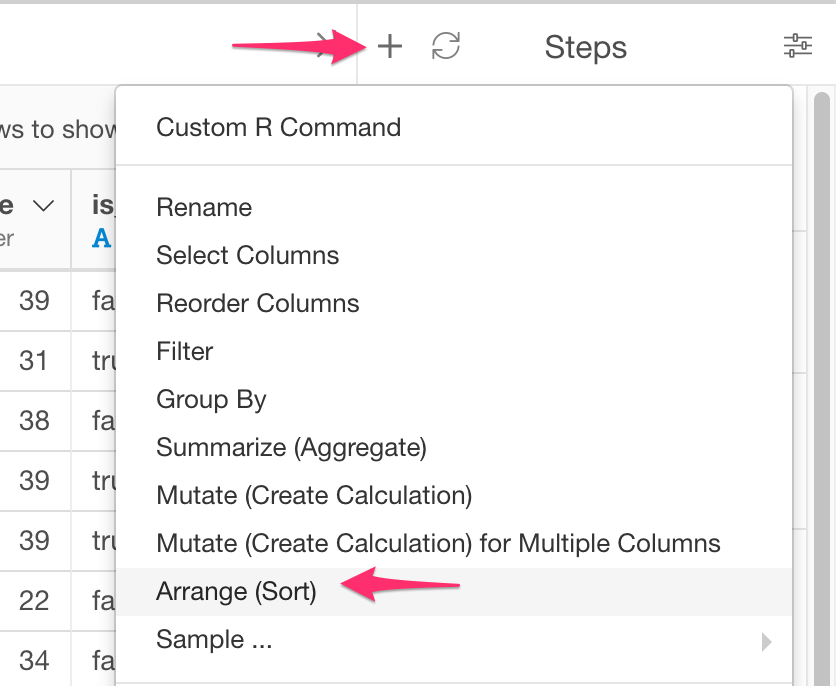
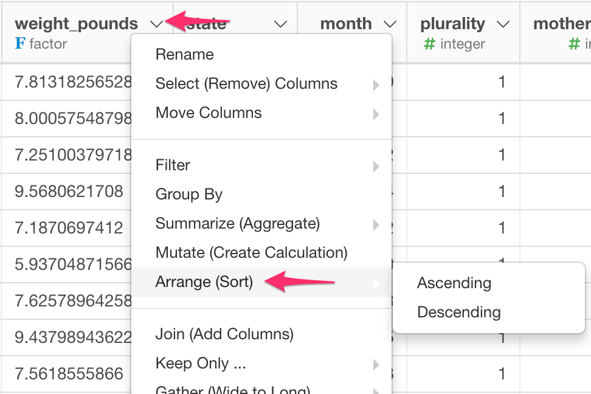

# Arrange (Sort)

Sort rows by given column(s)

## How to Access This Feature

### From + (plus) Button

* Click "+" button and select "Arrange (Sort)".

### From Column Menu

* You can also select "Arrange (Sort)" from the column menu of the column by which you want to sort the rows, and then select its submenu to specify sort order ("Ascending" or "Descending").

## Arrange (Sort) Rows

* Select the column by whose values you want to sort the rows.
* Select "Ascending" or "Descending" from "Sort Order".
* Click "Run" button to sort rows.
