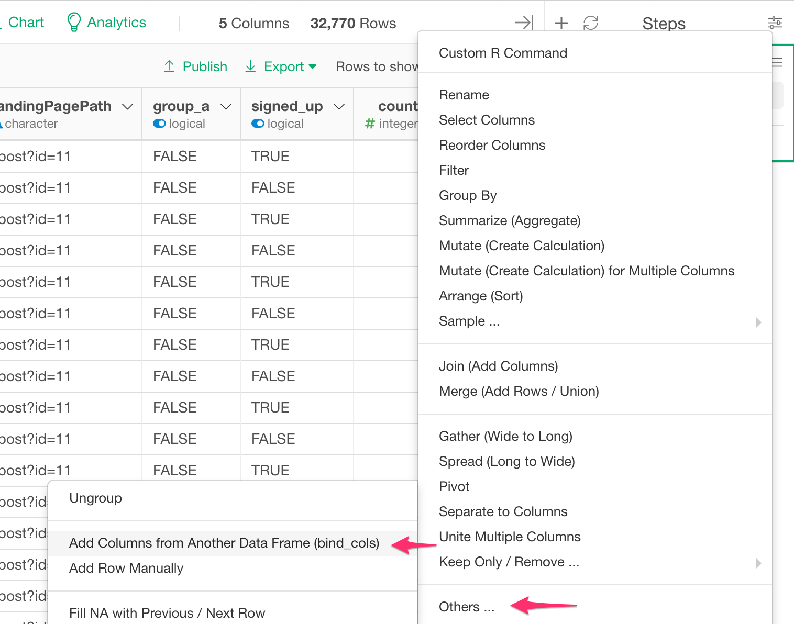

# Bind Columns 
Bind multiple data frames by column.

## How to Access This Feature

### From + (plus) Button

* Click "+" button and select "Other" - > "Add Columns from Another Data Frames (bind_cols)""

## Bind multiple data frames by Column

1. Select Data Frames that you want to bind.
