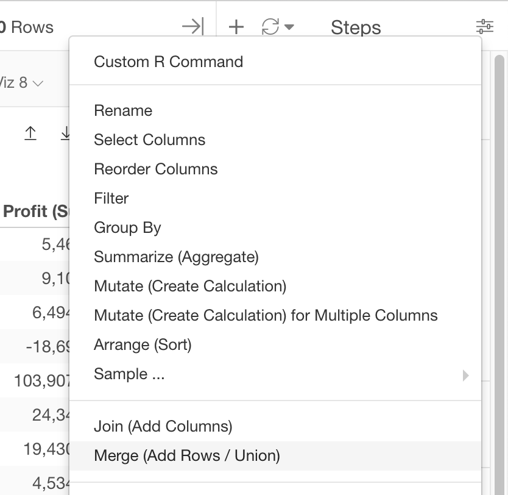
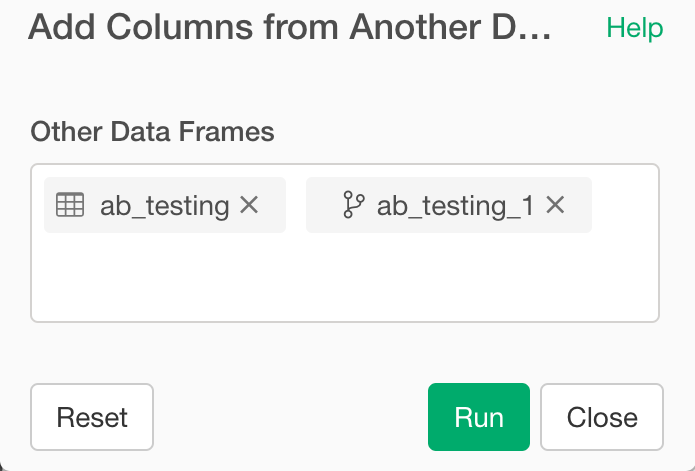

# Bind Columns 
Bind multiple data frames by column.

## How to Access This Feature

### From + (plus) Button

* Click "+" button and select "Other" - > "Bind ..." -> "Columns"

## Bind multiple data frames by row

1. Select Data Frames that you want to bind.
