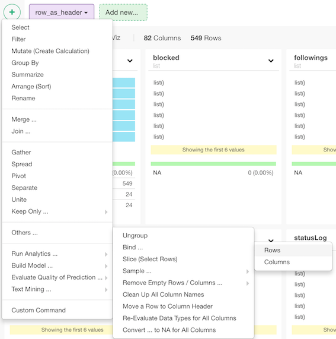
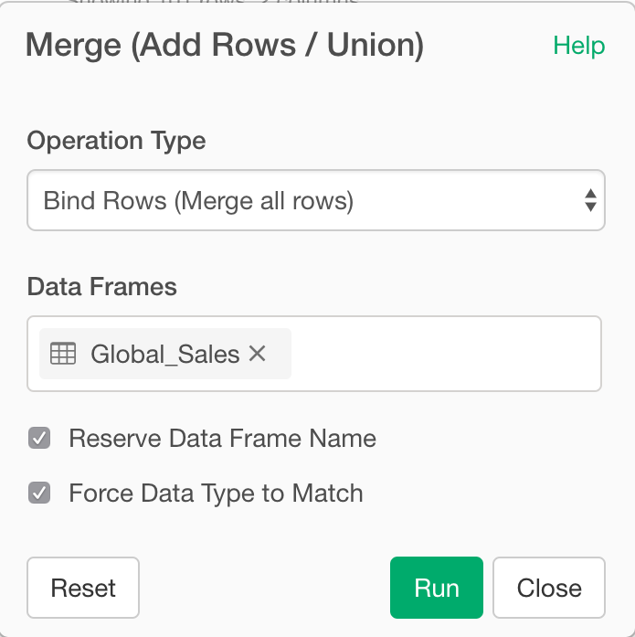

# Bind Rows
Bind multiple data frames by row.

## How to Access This Feature

### From + (plus) Button

* Click "+" button and select "Merge (Add Rows / Union)"

## Bind multiple data frames by row

1. Select Operation Type for the Merge
2. Select Data Frames that you want to bind.
3. Reserve Data Frame Name - When this checkbox is checked, Data Frame Name is automatically added as a new ID column.
4. Force Data Type to Match - When this checkbox is checked, it allows you to merge data frames whose column data types are different. After the merge, it detects and assigns appropriate data types to these columns.
