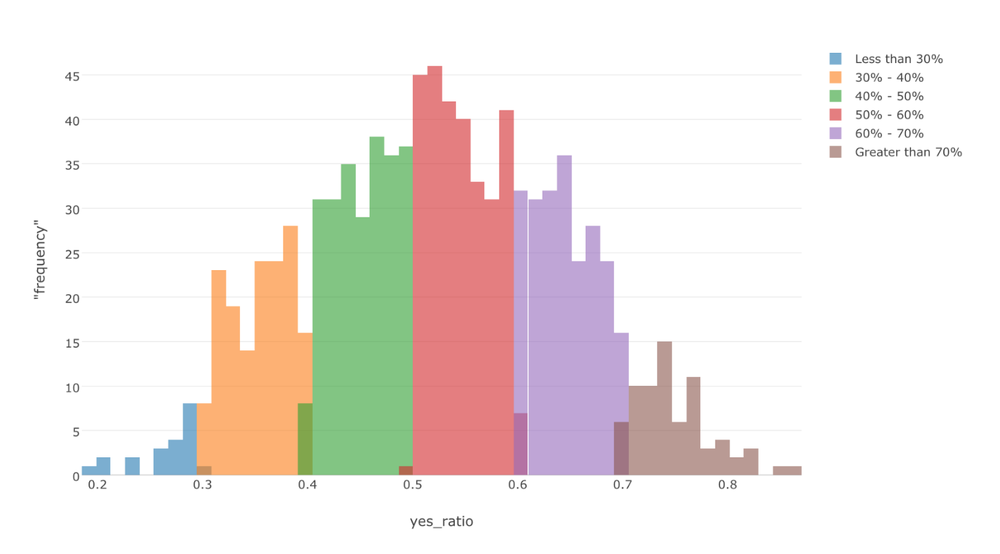
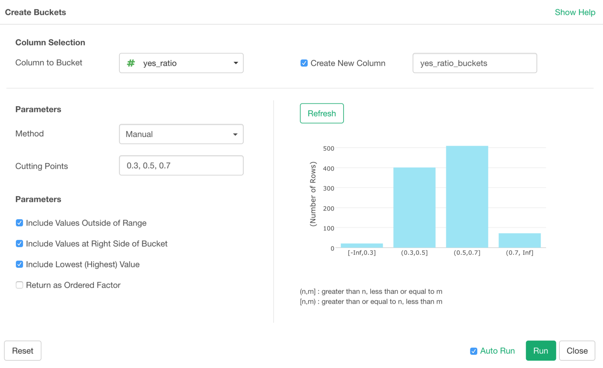

# Create Buckets

We can categorize or bucket the numeric values into a set of ‘buckets’ like below.

This is called ‘bucketing’ or ‘binning’. The basic idea is to assign each numeric value to one of the ‘buckets’ based on given conditions or rules.

## How to Access?

## How to Use?

There are various ways to create the buckets.

* Equal Length
* Equal Frequency (Quantile)
* Manual
* K-Means Clustering
* Outlier Detection

Take a look at this post for more details.

* [Creating Buckets or Clusters for Numeric Column Values in Exploratory](https://blog.exploratory.io/creating-buckets-or-clusters-for-numeric-column-values-in-exploratory-d04901b32d35)
