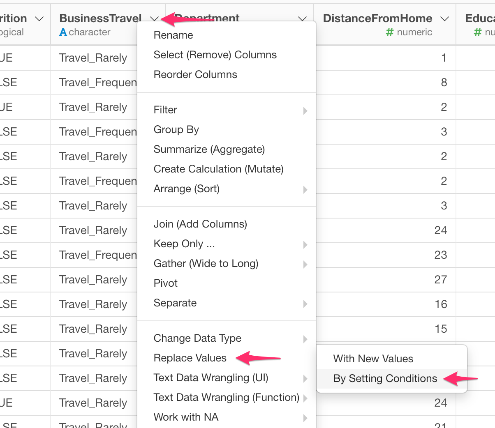
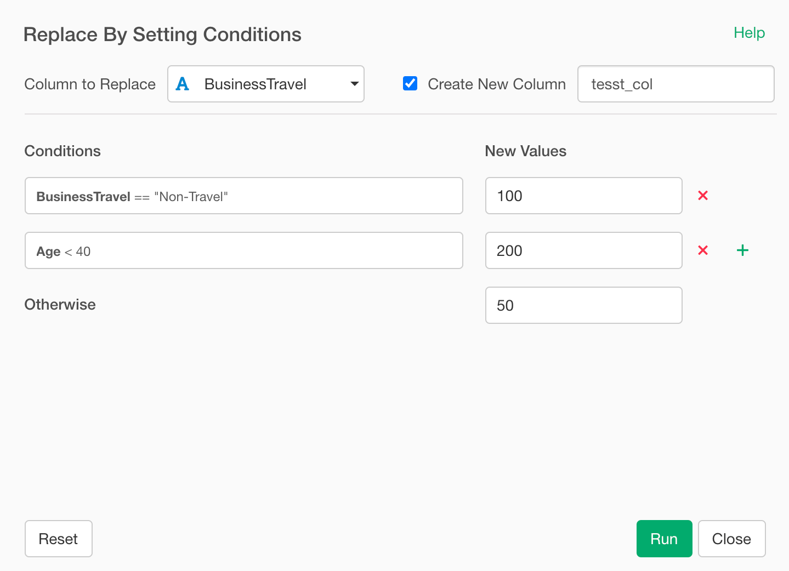
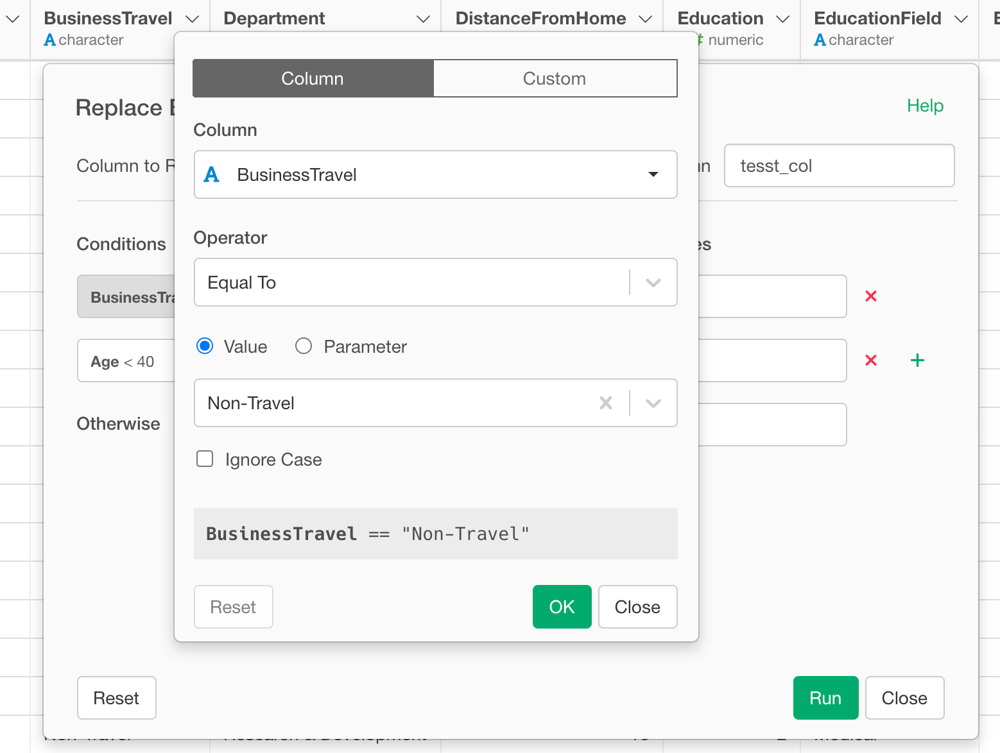
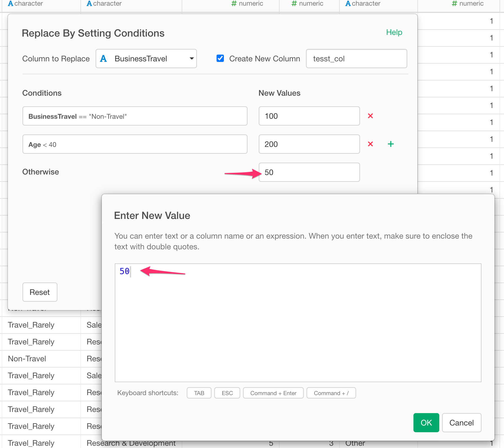

# Assign New Values by Setting Conditions - Case When

You can assign new values to a column by setting conditions with easy-to-use dialog UI.

## How to Access?

* From Column Menu on Character Column, select "Replace Values" -> "By Setting Conditions".

## How to Use?

### Set Condition and New Values

To assign new value, you need to set a condition. For example, if you want to assign 100 for the case where BusinessTravel column value is "Non-Travel" like below screenshoot,

then you can click the condition and set it in the Filter like dialog.

### Set New Values

To set a new value for each condition, click the New Value field and then Enter New Value Dialog popup. Enter value and click OK.

