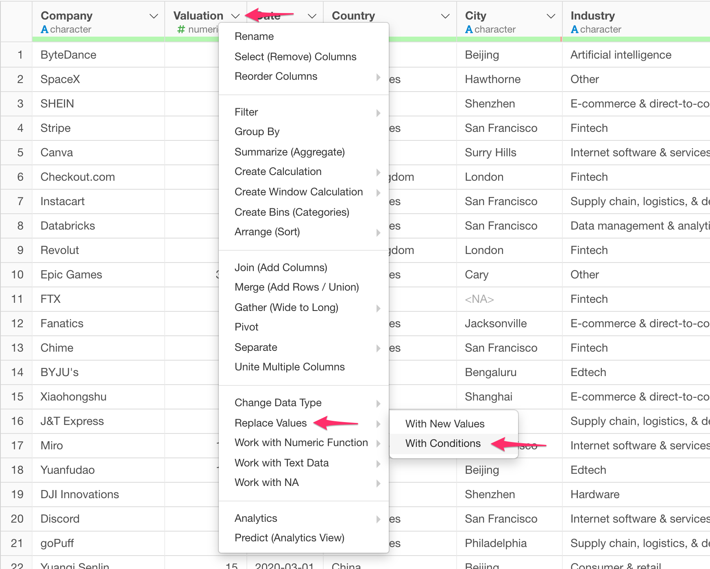
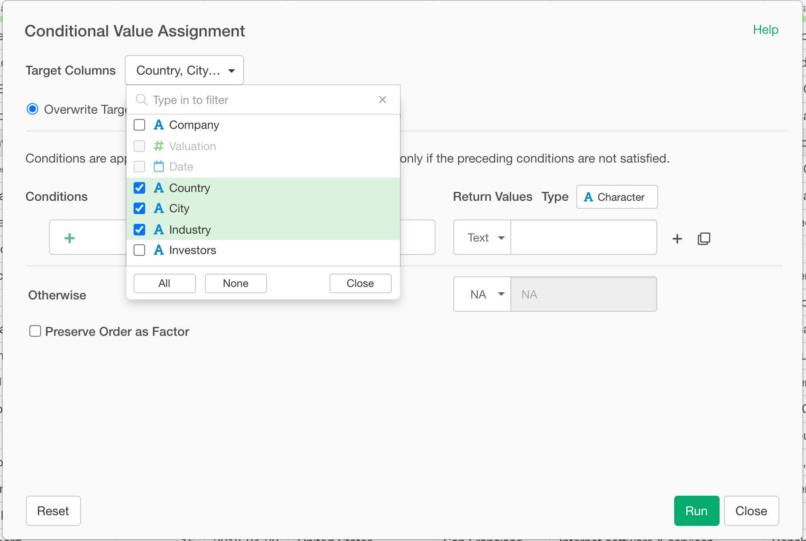
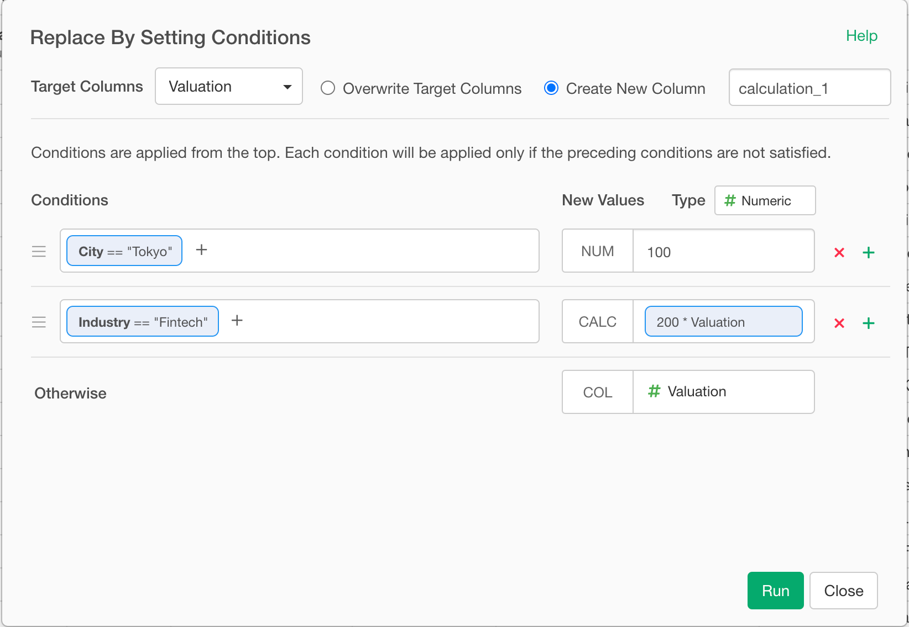
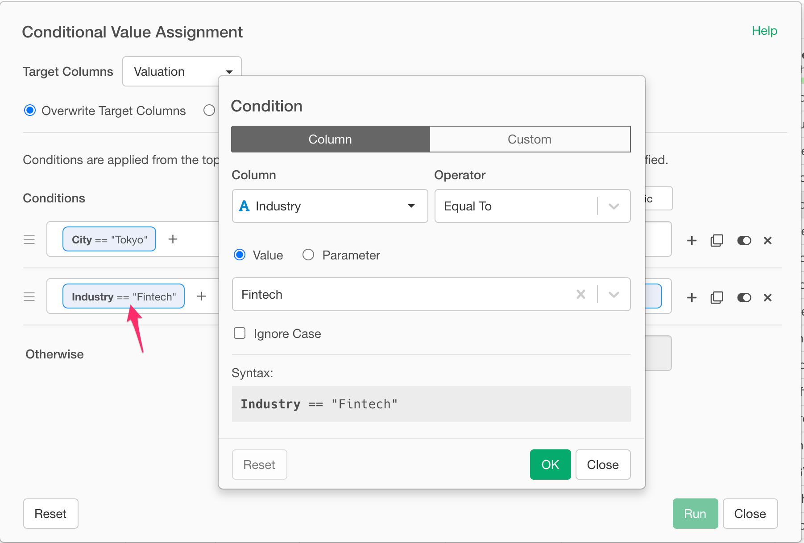
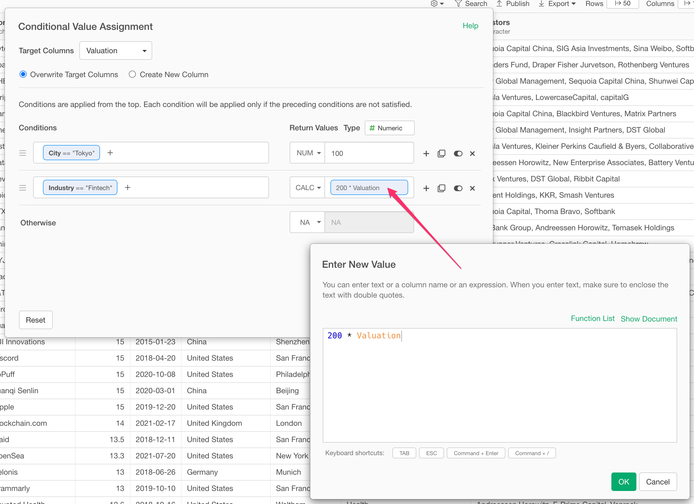
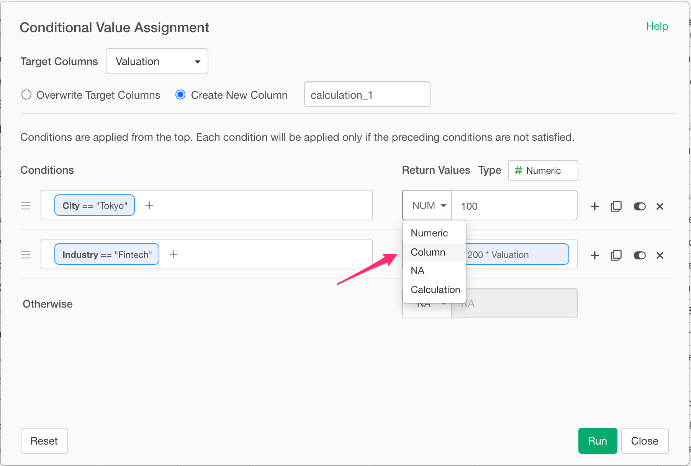

# Assign New Values by Setting Conditions - Case When

You can assign new values to a column by setting conditions with easy-to-use dialog UI.

## How to Access?

* From Column Menu on Character Column, select "Replace Values" -> "With Conditions".

## How to Use?

### Select Target Columns

You can select a column or multiple columns for this operation. To select multiple columns, check the checkboxes for the columns you want to perform this operation.

### Set Condition and New Values

To assign new value, you need to set a condition. For example, if you want to assign 100 for the case where City column value is "Tokyo" like below screenshoot,

then you can click the condition and set it in the Filter like dialog.

### Set New Values

To set a new value for each condition, you can select either of followings:

- Input Field (Text Input Field for Character column and Number Input Field for for Numeric column.)
- Column
- NA
- Calculation

To change the type, click the button label and select the available option.

