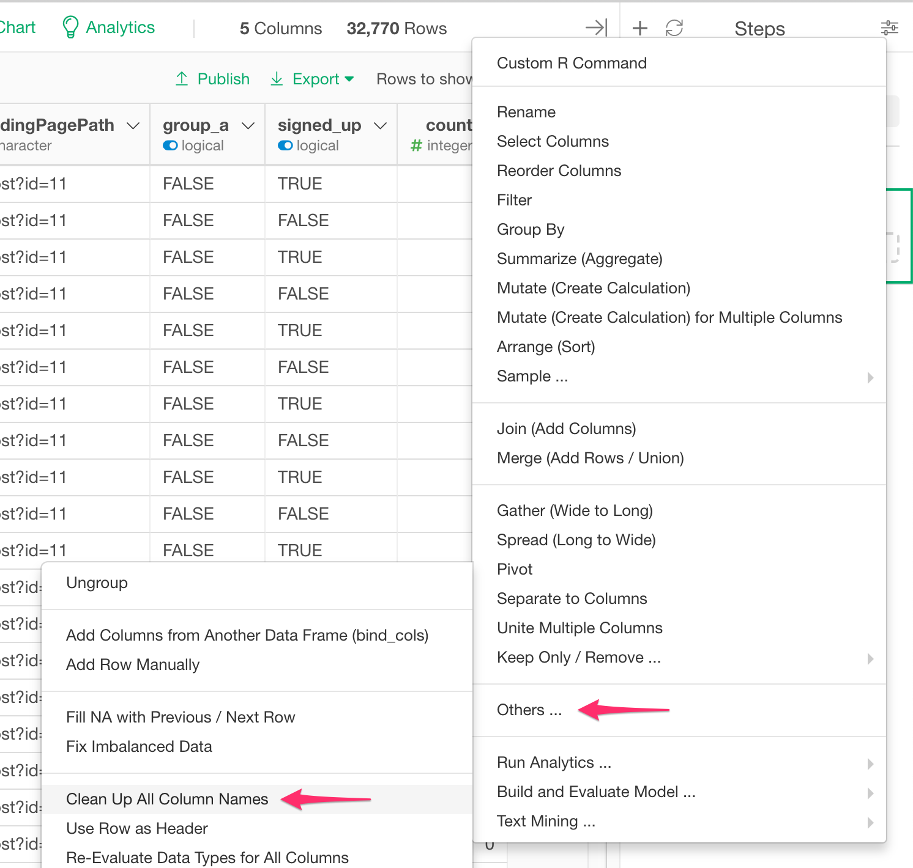
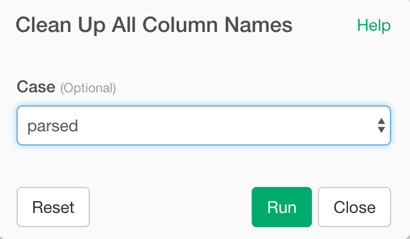

# Clean Column Names
Clean up all column names on the data frame.

## How to Access This Feature

### From + (plus) Button

* Click "+" button and select "Others..." -> "Clean Up All Column Names".

## Clean Column Names

1. Case - Case of the Resulting Column Names. Supported options are:

- parsed
- snake_case
- lowerCamel
- UpperCamel
- ALL_CAPS
- lowerUpper
- UPPERlower
- multibyte

### parsed
A column name is created with multiple words that are joined together with an underscore (_) as the separator and current case is preserved.

For example, "Product Name" becomes "Product_Name".

### snake_case
A column name is created with multiple words that are joined together with an underscore (_) as the separator and each word is lowercased.

For example, "Product Name" becomes "product_name".

### lowerCamel
A column name is created with multiple words that are joined together as a single word with the first letter of each word (except the first one) uppercased.

For example, "Product Name" becomes "productName".

### UpperCamel
A column name is created with multiple words that are joined together as a single word with the first letter of each of the multiple words uppercased within the new word that forms the Column Name.

For example, "Product Name" becomes "ProductName".

### ALL_CAPS
A column name is created with multiple words that are joined together with an underscore (_) as the separator and each word is uppercased.

For example, "Product Name" becomes "PRODUCT_NAME".

### lowerUpper
A column name is created with multiple words that are joined together as a single word with each word alternating with lowercased and uppercased.

For example, "Product Detail Description" becomes "productDETAILdescription".

### UPPERlower
A column name is created with multiple words that are joined together as a single word with each word alternating with uppercased and lowercased.

For example, "Product Detail Description" becomes "PRODUCTdetailDESCRIPTION".

### multibyte
Same as parsed. If your column name contains multibyte characters and separated unexpected way with "parsed" option, try this multibyte option.

For example, "製品 名称" becomes "製品_名称".
