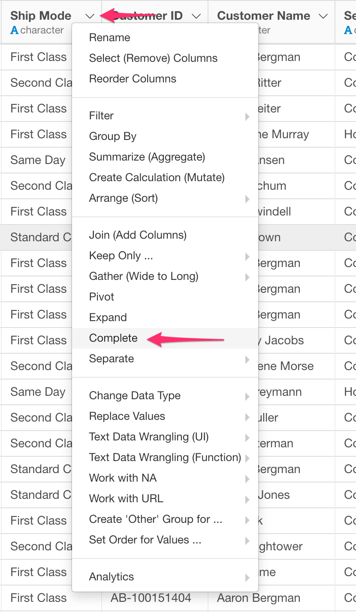
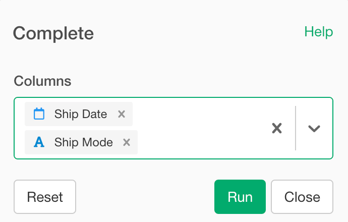

# Complete

Complete commands turns implicit missing values into explicit missing values and is useful for completing missing combinations of data.

## How to Access This Feature

## Complete

* Select columns that you want to complete combinations of values.
* Click "Run".
