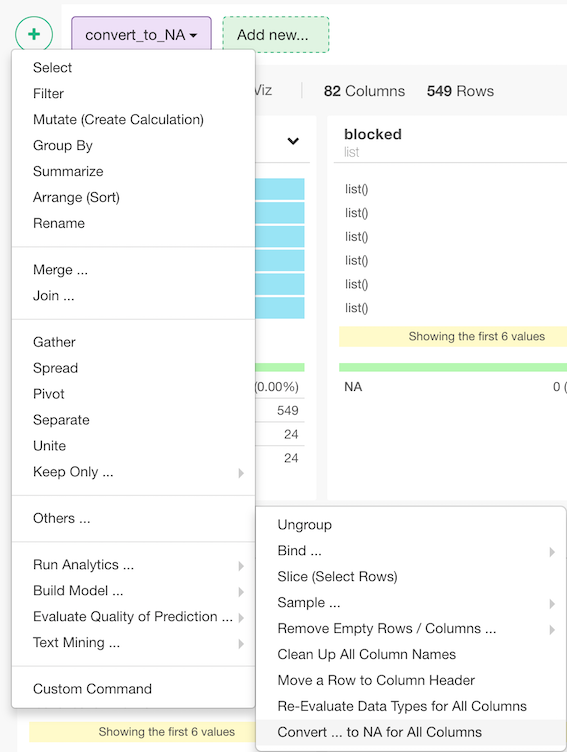
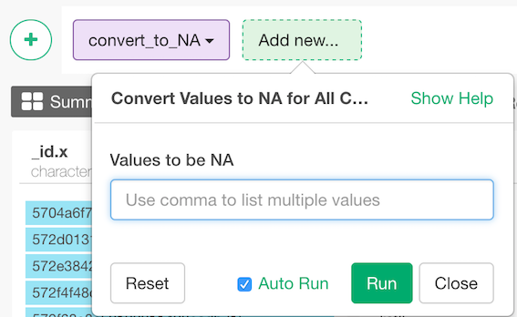

# Convert to NA
Convert specific values to NA.

## How to Access This Feature

### From + (plus) Button

* Click "+" button and select "Other" - > "Convert ... to NA for All Columns"

## Bind multiple data frames by row

1. Values to be NA - Characters to be changed to NA. (e.g. `Not Available`). You need to use comma(,) to enter multiple values. (e.g. `NA, N/A`) 
