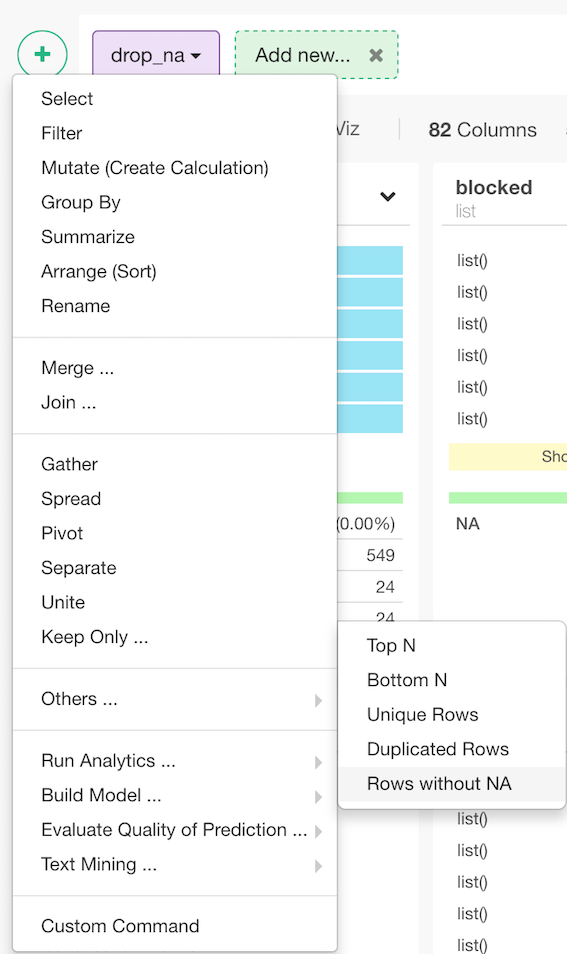
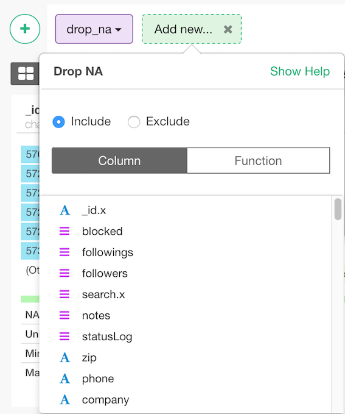

# Drop NA
Drop rows that have NA value.

## How to Access This Feature

### From + (plus) Button

* Click "+" button and select "Other" - > "KeepBind ..." -> "Columns"

## Bind multiple data frames by Column

1. Select column(s) with which you want to remove rows without NA values
