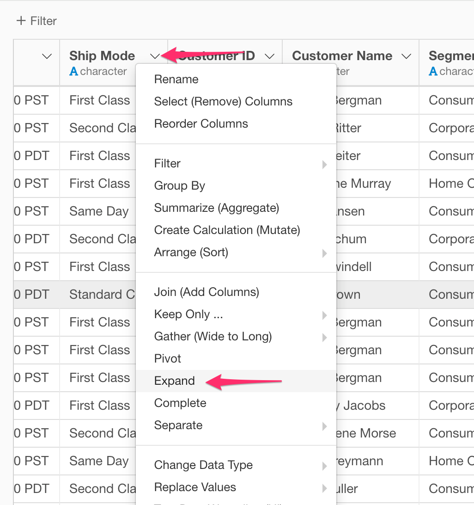
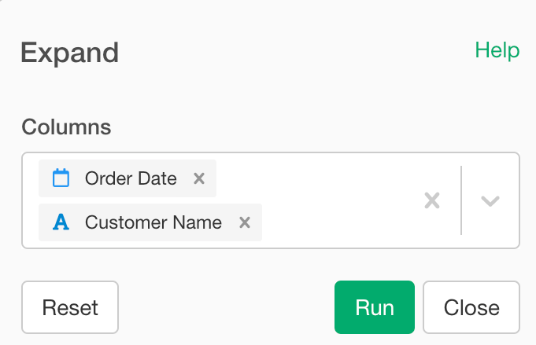

# Expand

Expand a data frame to include all combinations of values. Unlike the Complete command, the resulting data frame does not include columns that are not selected. 

## How to Access This Feature

## Expand

* Select columns that you want to have all combinations of values.
* Click "Run".
