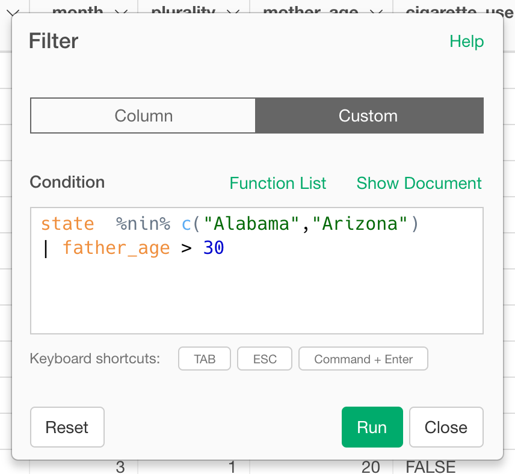

# Filter

Return rows with matching conditions

### Operators

When creating a filter, Exploratory supports below operators for each column data type.

#### Numeric

- Equal To
- Not Equal To
- Is In (Multiple Values)
- Is Not In (Multiple Values)
- Less Than
- Less Than or Equal To
- Greater Than
- Greater Than Or Equal To
- Between
- Not Between
- Is NA
- Not NA
- Is Outlier
- Not Outlier

As For Outlier operator, we support IQR (Interquartile Range), 95 Percentile, 99 Percentile, 2 Standard Deviation, and 3 Standard Deviation as Type of Outlier Detection. Also, you can specify the Range from following options:

- Upper and Lower
- Upper
- Lower

So if you select "Is Outlier" and "95 Percentile" as Type of Detection, and "Upper" as the Range, it only keeps data that fit inside Upper 95 Percentile.  

#### Character

- Starts With
- Not Starts With
- Ends With
- Not End With
- Contains
- Not Contain
- Keep Only Stopword
- Remove Stopword
- Keep Only Alphabet
- Remove Alphabet
- Remove Empty
- Keep Only Empty
- Is NA
- Not NA

### Date / Time

- Relative Date
- Equal To
- Not Equal To
- Is In (Multiple Values)
- Is Not In (Multiple Values)
- Earlier Than
- Earlier Than or Equal To
- Later Than
- Later Than Or Equal To
- Between
- Not Between
- Is NA
- Not NA

## Filter by Custom R Expression

1. Select "Custom" tab.
2. Type in the R Expression for the filtering condition in "Condition" field.
3. Click "Run" to filter the rows based on the condition.
