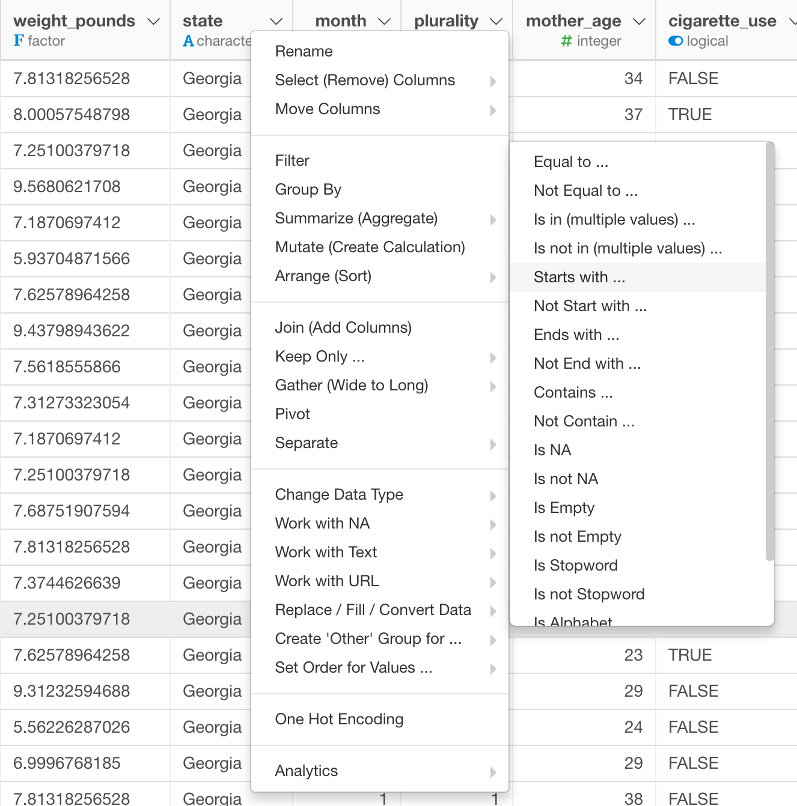
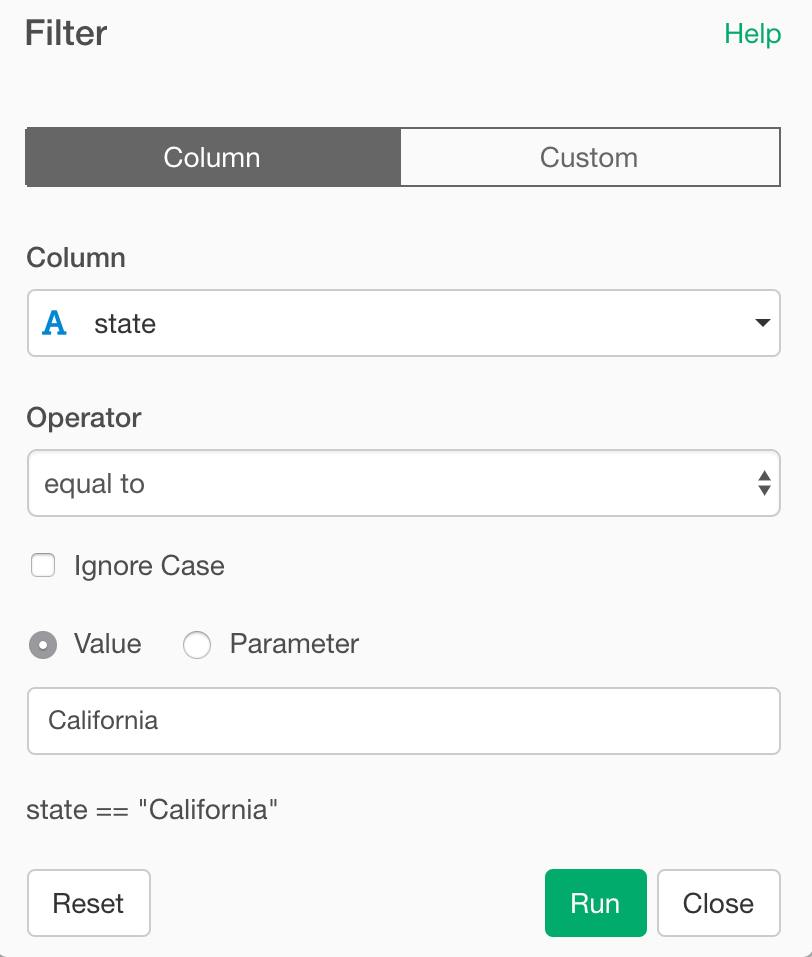

# Filter
Return rows with matching conditions

## How to Access This Feature

### From + (plus) Button

* Click "+" button and select "Filter".

### From Column Menu

* You can also select "Filter" from column menu of the column to apply filtering, and then select its submenu to choose the type of filtering.

## Filter by Selecting Filtering Rule from UI

1. Select "Column" tab.
2. Select the column to apply the filtering condition from "Column" dropdown list.
3. Select operator for filtering condition from "Operator" dropdown list.
4. (Optional) Ignore Case - For Character related operators, you can enable Ignore Case to do case insensitive filtering.
4. Specify the detail of filtering condition by filling the rest of the fields in the dialog box. For "equal to" or "not equal to" condition value, you can either select (or type) value or select Parameter.
5. Click "Run" to filter the rows based on the condition.

## Filter by Custom R Expression

1. Select "Custom" tab.
2. Type in the R Expression for the filtering condition in "Condition" field.
3. Click "Run" to filter the rows based on the condition.
