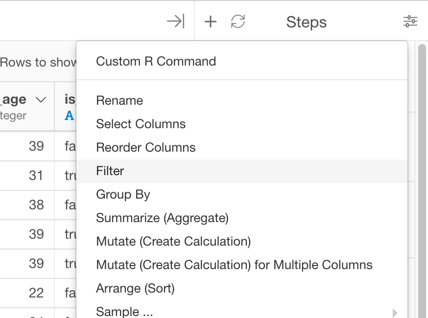

# Filter
Return rows with matching conditions

## How to Access This Feature

### From + (plus) Button

* Click "+" button and select "Filter".

### From Column Menu

* You can also select "Filter" from column menu of the column to apply filtering, and then select its submenu to choose the type of filtering.

## Filter by Selecting Filtering Rule from UI

1. Select "Column" tab.
2. Select the column to apply the filtering condition from "Column" dropdown list.
3. Select operator for filtering condition from "Operator" dropdown list.
4. (Optional) Ignore Case - For Character related operators, you can enable Ignore Case to do case insensitive filtering.
4. Specify the detail of filtering condition by filling the rest of the fields in the dialog box. For "equal to" or "not equal to" condition value, you can either select (or type) value or select Parameter.
6. Click "Run" to filter the rows based on the condition.

### Operators

When creating a filter, Exploratory Desktop supports below operators for each column data type.

#### Numeric
- Equal To
- Not Equal To
- Is In (Multiple Values)
- Is Not In (Multiple Values)
- Less Than
- Less Than or Equal To
- Greater Than
- Greater Than Or Equal To
- Between
- Not Between
- Is NA
- Not NA
- Is Outlier
- Not Outlier

As For Outlier operator, we support IQR (Interquartile Range), 95 Percentile, 99 Percentile, 2 Standard Deviation, and 3 Standard Deviation as Type of Outlier Detection. Also, you can specify the Range from following options:

- Upper and Lower
- Upper
- Lower

So if you select "Is Outlier" and "95 Percentile" as Type of Detection, and "Upper" as the Range, it only keeps data that fit inside Upper 95 Percentile.  

#### Character
- Starts With
- Not Starts With
- Ends With
- Not End With
- Contains
- Not Contain
- Keep Only Stopword
- Remove Stopword
- Keep Only Alphabet
- Remove Alphabet
- Remove Empty
- Keep Only Empty
- Is NA
- Not NA

### Date / Time
- Relative Date
- Equal To
- Not Equal To
- Is In (Multiple Values)
- Is Not In (Multiple Values)
- Earlier Than
- Earlier Than or Equal To
- Later Than
- Later Than Or Equal To
- Between
- Not Between
- Is NA
- Not NA
  
#### Date
- Keep 

## Filter by Custom R Expression

1. Select "Custom" tab.
2. Type in the R Expression for the filtering condition in "Condition" field.
3. Click "Run" to filter the rows based on the condition.
