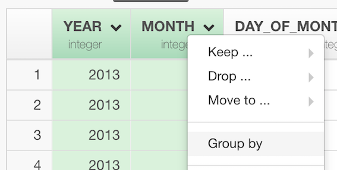
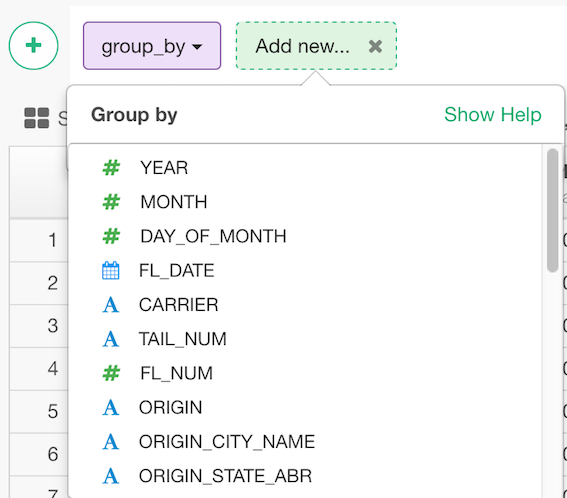

# Group Rows
Converts the data frame into a grouped data frame where the following operations will be performed based on the groups. Grouping should be done before you want to aggregate values.

## How to Access This Feature

### From + (plus) Button

* Click "+" button and select "Group By".

### From Column Menu

* You can also select "Group By" from the column menu of the column by whose values you want to group the rows.

## Group Rows

* Select the column by whose values you want to group the rows.
