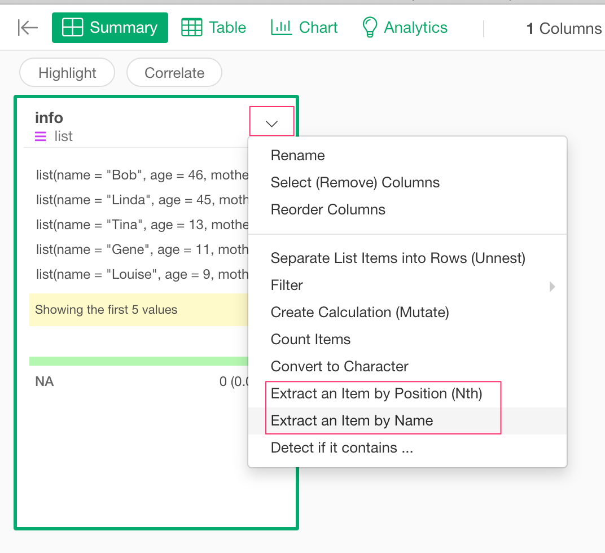
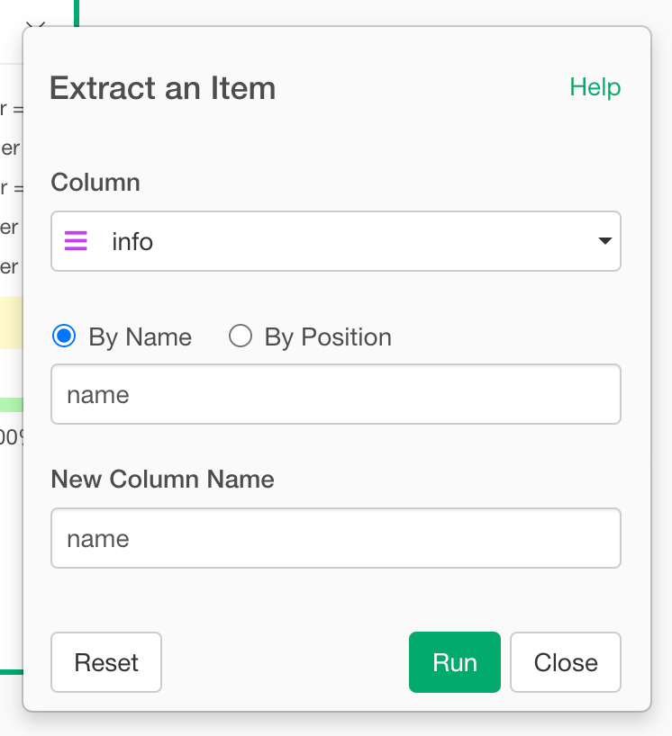

# Hoist

Hoist allows you to selectively pull component of a list-column out in to their own top-level column, using the same syntax as purrr::pluck().

## How to Access This Feature

You can access it from column menu of list columns.

## Unnest

* Column - List column from where you select a component.
* By Name or By Position - flag to decide whether you pull component by item name or by item position.
* Name (or Position) - The name (or the index) of the item that you want to pull.
* New Column Name - The resulting column name.
