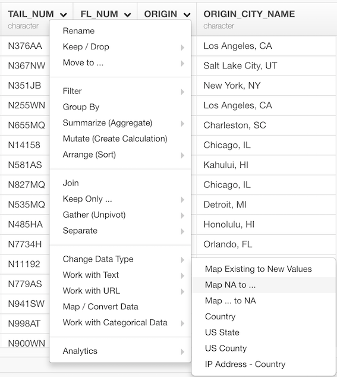
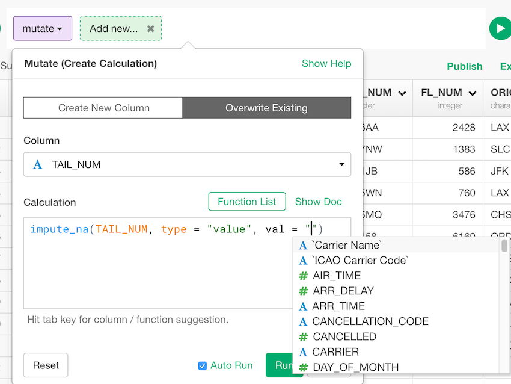

# Impute NA

Impute NA by average / median values, manually entered values, or predicted values. It will build a linear regression model for the prediction.

## How to Access This Feature

* From Column Menu for Character Column, select "Map / Convert Data" ->  "Map NA to ..." 

## Impute NA

In Calculation field, impute command is partially filled. So complete it by entering following.

1. `Column` - predictor column. this works only when type is "predict". Columns to be used as predictors.
2. `type`  - The default is "mean". Set how you want to impute NA. This can be numeric value to replace NA or types listed below.
* "mean" - Mean value
* "median" - Median value
* "value" - Replace the missing values with val
* "predict" - Predict possible values based on other columns
3. `val` (Optional) - This works when type is "value" or "predict". When it's "value", a value to replace NA or a column to replace NA at the same position. If it's "predict", a column to use for prediction of NA. More than one column can be used by indicating <column(s)>.
