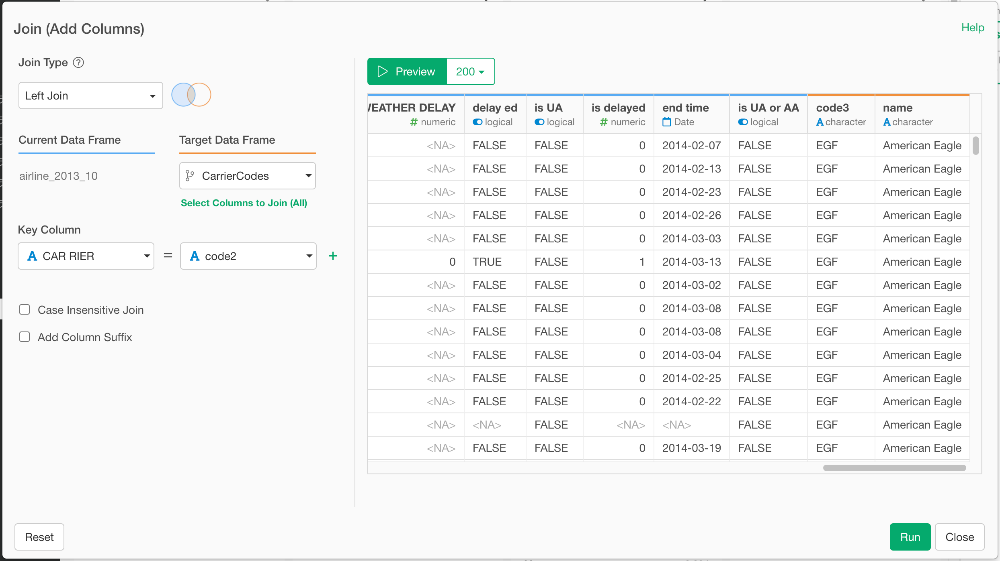

# Join Data

Join rows from the data frame with rows from another data frame by matching values of key columns.

## How to Access This Feature

### From + (plus) Button

### From Column Menu

## How to Use This Feature

1. Select "Join Type".

  * Left Join - Return all rows from the current data frame, and all columns from the current and the target. Rows in the current with no match in the target will have NA values in the new columns. If there are multiple matches between the current and the target, all combinations of the matches are returned.
  * Right Join - Return all rows from the target data frame, and all columns from the current and the target.
  * Full Join - Return all rows and all columns from both the current data frame and the target data frame.
  * Inner Join - Return all rows from the current data frame where there are matching values in the current, and all columns from the current and the target.
  * Semi Join - Return all rows from the current data frame where there are matching values in the target data frame, keeping just columns from the current.
  * Anti Join - Return all rows from the current data frame where there are not matching values in the target, keeping just columns from the current.

2. Select "Target Data Frame".

  Select the other data frame to join current data frame with.

3. Select "Current Column" and "Target Column".
  "Current Column" is a column from current data frame, and "Target Column" is a column from target data frame. When a row from current data frame and a row from target data frame have same values in those columns, the rows are joined into one row in the resulting data frame.

4. Specify "Current Columns Suffix" and/or "Target Columns Suffix" (Optional)
  These are the suffixes to distinguish columns from current data frame and columns from target data frame in the resulting data frame, when there are columns with same names in both data frames. Note that those suffixes are applied only to column names that appear both in current and target data frames.

5. Click "Run" button.

## References
* [Introduction to Join — Bring extra columns from the target in Exploratory](https://blog.exploratory.io/introduction-to-join-bring-extra-columns-from-the-target-in-exploratory-1ec585ec2cf1)
* [Introduction to Join — filtering data based on the target data in Exploratory](https://blog.exploratory.io/introduction-to-join-filtering-data-based-on-the-target-data-in-exploratory-eedbd7b39d0a)
