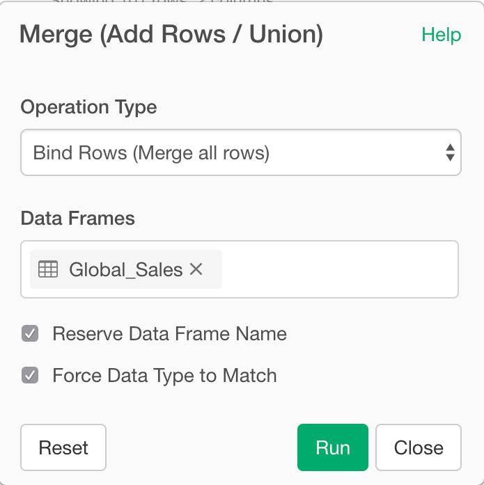

# Merge multiple Data Frames
Merge multiple data frames by row.

## How to Access This Feature

### From + (plus) Button

* Click "+" button and select "Merge (Add Rows / Union)"

## Bind multiple data frames by row

1. Select Operation Type for the Merge. Supported options are:

- Bind Rows (Merge all rows)
- Union (Merge only unique rows)
- Intersection (Merge only the common)
- Setdiff (Merge only the difference)

2. Select the Data Frames you want to merge. You can select a single or multiple data frames.
3. (Optional) You can enable 'Reserve Data Frame Name' option to create a new column to hold the names of merged data frames.
4. (Optional) You can enable 'Force Data Type to Match' to merge the data frames even when the data types of the corresponding columns are different. After the merge, it detects and assigns appropriate data types automatically.
