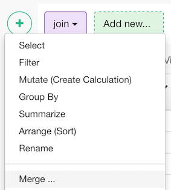
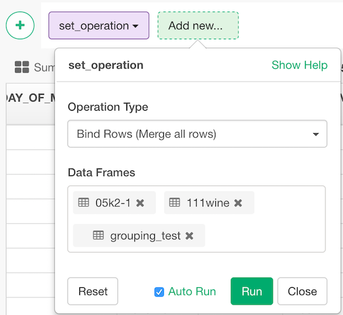

# Merge Multiple Data Frames

Merge two data frames by common columns or row names, or do other versions of database _join_ operations

## How to Access This Feature

* Click "+" button and select "Merge".

## Merge data frames from UI

* bind_rows
* union
* intersect
* setdiff

Take a look at this post for more details.

* [Merging two data frames with union or bind_rows](https://blog.exploratory.io/merging-two-data-frames-with-union-or-bind-rows-a55e79766d0)
