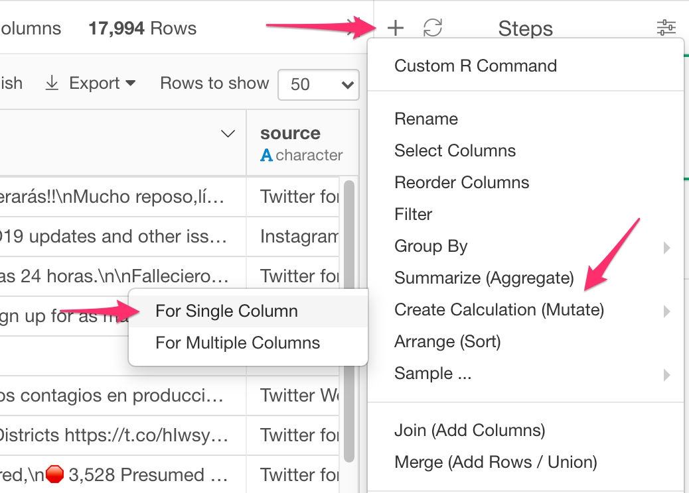

# Create New Calculation

Mutate creates new column(s) with given expressions and preserves existing column(s). To override existing column, you can select existing column on Mutate Dialog. 

## How to Access This Feature

### From + (plus) Button

* Click "+" button and select "Mutate (Create Calculation)".

### From Column Menu

* You can also select "Mutate (Create Calculation)" from column menu of the column which becomes the basis of the new calculation.

## Create New Column with New Calculation

1. Select "Create New Column" tab.
2. Type in the name of new column in "New Column Name" field.
3. Type in the R Calculation in "Calculation" field.
4. Click "Run" to run the calculation and create the new column.

## Overwrite Existing Column with New Calculation

1. Select "Overwrite Existing" tab.
2. Select the column to overwrite with the new calculation from "Column" list.
3. Type in the R Calculation in "Calculation" field.
4. Click "Run" to run the calculation and overwrite the values of the column.
