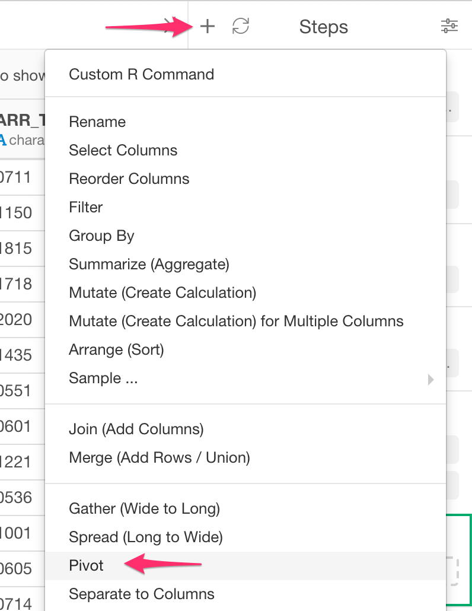
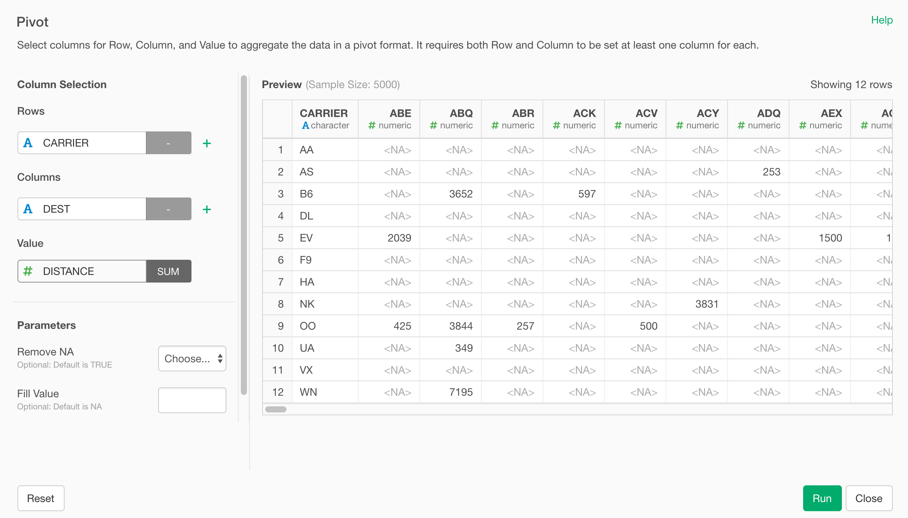

# Pivot

Pivot columns into rows and columns. Values are count of pairs of rows and columns or aggregation of another column.

## How to Access This Feature

* Click "+" button and select "Pivot" 

### From Column Menu

* You can also select "Pivot" from column menu of the column you want to pivot.

## Pivot

1. `Rows` - select columns for Pivot Row.
2. `Columns`  - select colums for Pivot Columns.
3. `Value` (Optional) - A column for values in output data frame.

### Parameters

* Remove NA - The default is TRUE. If NA should be removed from value.
* Fill NA with - The default is 0. This is what should be used for missing value in groups.

<strong>Example</strong>

<em>Original data:</em>  

<table><thead><tr><th style=\"text-align: left\">clarity</th>
<th style=\"text-align: left\">certification</th>
<th style=\"text-align: left\">colour</th><th style=\"text-align: right\">price</th></tr>
</thead><tbody><tr><td style=\"text-align: left\">VVS2</td><td style=\"text-align: left\">HRD</td>  <td style=\"text-align: left\">F</td><td style=\"text-align: right\">10796</td></tr><tr><td style=\"text-align: left\">VS1</td><td style=\"text-align: left\">GIA</td>  <td style=\"text-align: left\">F</td><td style=\"text-align: right\">1551</td></tr><tr><td style=\"text-align: left\">VS1</td>  <td style=\"text-align: left\">GIA</td>  <td style=\"text-align: left\">F</td>  <td style=\"text-align: right\">4291</td></tr>  <tr>  <td style=\"text-align: left\">VVS2</td>  <td style=\"text-align: left\">GIA</td>  <td style=\"text-align: left\">F</td>  <td style=\"text-align: right\">5881</td>  </tr>  <tr>  <td style=\"text-align: left\">VS2</td>  <td style=\"text-align: left\">GIA</td>  <td style=\"text-align: left\">H</td>  <td style=\"text-align: right\">4585</td>  </tr>  <tr>  <td style=\"text-align: left\">VVS2</td>  <td style=\"text-align: left\">GIA</td>  <td style=\"text-align: left\">H</td>  <td style=\"text-align: right\">5193</td>  </tr>  </tbody></table>    

 if you set <strong>row</strong>: clarify, colour <strong>columns</strong>: certification <strong>value</strong>: price <strong>fill</strong>:0

   <em>it returns data frame with rows of combinations of clarity and colour and with columns of certification. Values are sum of price and missing values are filled by 0.</em>

<table><thead>  <tr>  <th style=\"text-align: left\">clarity_colour</th>  <th style=\"text-align: right\">GIA</th>  <th style=\"text-align: right\">HRD</th>  </tr>  </thead><tbody>  <tr>  <td style=\"text-align: left\">VS1_F</td>  <td style=\"text-align: right\">5842</td>  <td style=\"text-align: right\">0</td>  </tr>  <tr>  <td style=\"text-align: left\">VS2_H</td>  <td style=\"text-align: right\">4585</td>  <td style=\"text-align: right\">0</td>  </tr>  <tr>  <td style=\"text-align: left\">VVS2_F</td>  <td style=\"text-align: right\">5881</td>  <td style=\"text-align: right\">10796</td>  </tr>  <tr>  <td style=\"text-align: left\">VVS2_H</td>  <td style=\"text-align: right\">5193</td>  <td style=\"text-align: right\">0</td>  </tr>  </tbody></table>  
