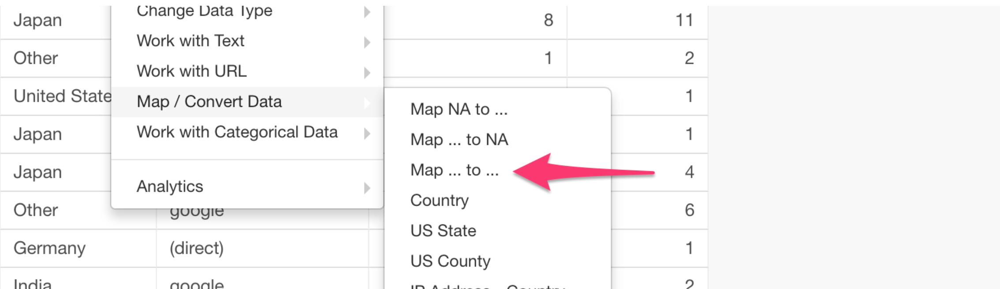
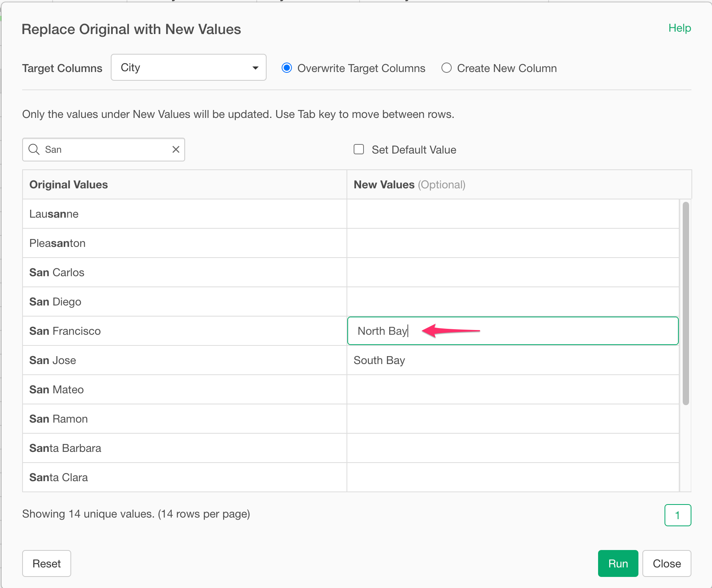
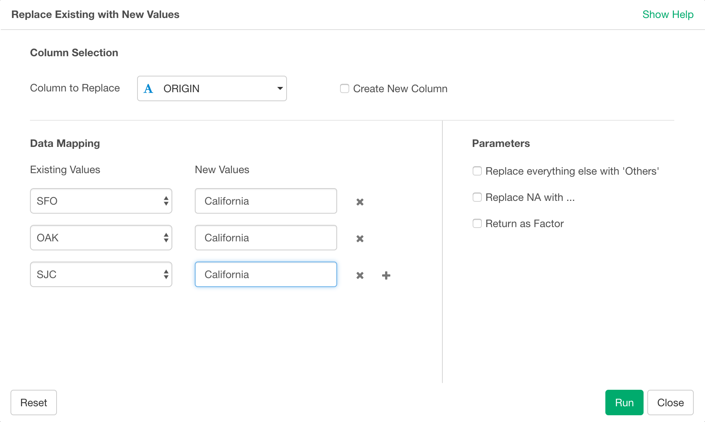

# Assign New Values to Existing Values - Recode

You can map existing values to new values by using easy-to-use dialog UI.

## How to Access?

* From Column Menu on Character Column, select "Map / Convert Data" -> "Map ... to ...".

## How to Use?

### One to One mapping

To simply map an item to a new one, you can select values from the dropdown and assign new values.

 

### Map multiple Existing Values to a same New Value.

To map multiple Existing Values to a same New Value, you can select existing values from the dropdown and assign the same New Value to each existing value.

For example, if you want to recode `SFO` (San Francisco International Airport), `OAK` (Oakland International Airport), and `SJC` (San Jose International Airport) to `California`, then you can assign `California` for all these three values as follows.

 
