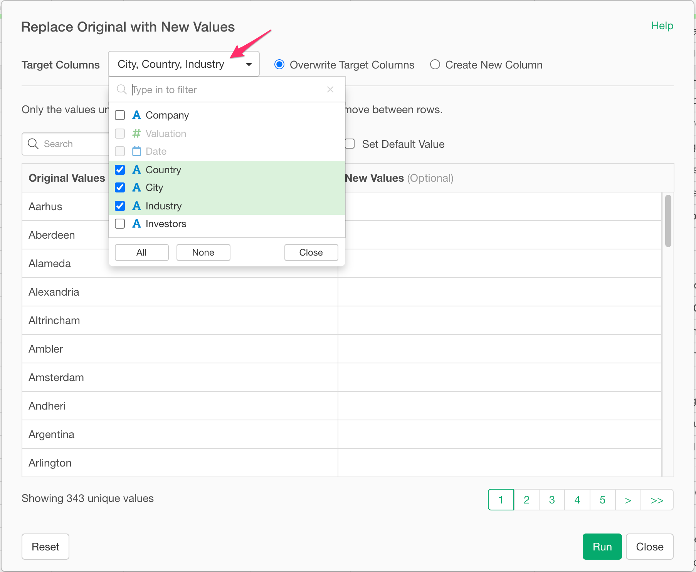

# Assign New Values to Existing Values - Recode

You can map existing values to new values by using easy-to-use dialog UI.

## How to Access?

* From the Column Menu on a Character Column, select "Replace Values" -> "With New Values".

## How to Use?

### Select Target Columns

You can select a column or multiple columns for this operation. To select multiple columns, check the checkboxes for the columns you want to perform this operation.

### Set New Values

To map multiple Existing Values to a same New Value, you can simply type in the new values.
For example, if you want to set `North Bay` for San Francisco and `South Bay` for San Jose, type in the values like the below screenshot.

 
