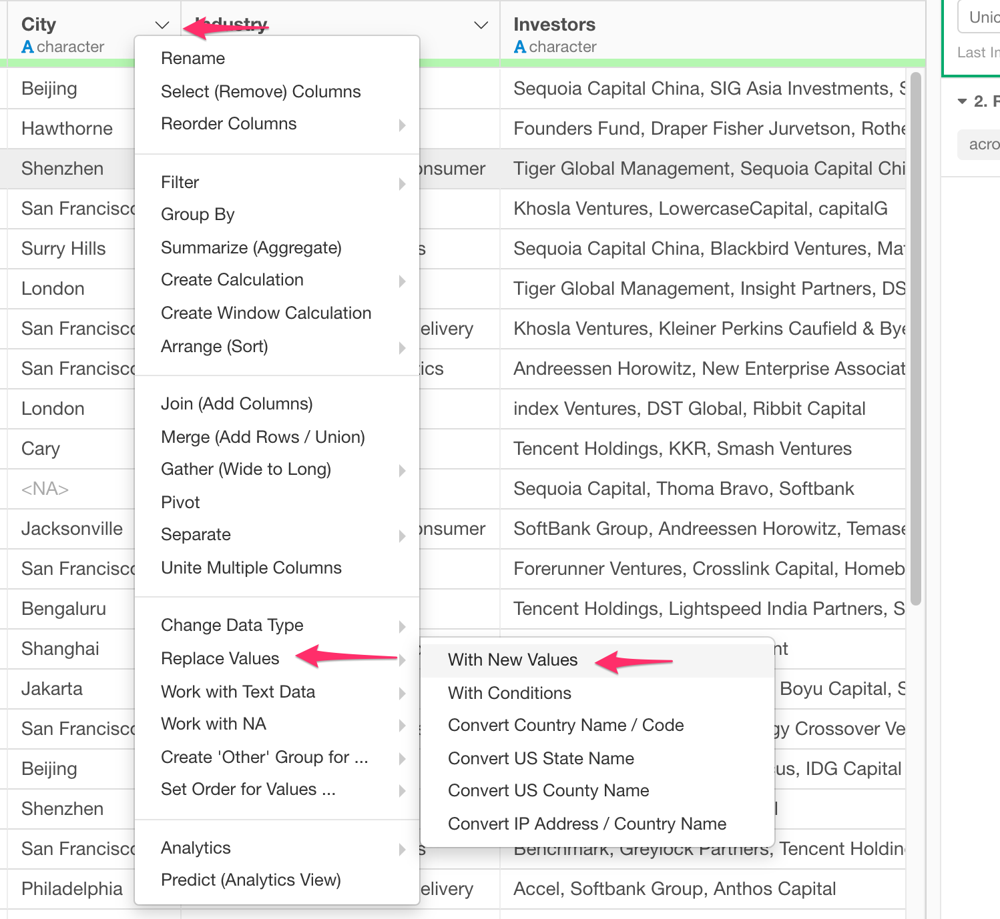

# Assign New Values to Existing Values - Recode

You can map existing values to new values by using easy-to-use dialog UI.

## How to Access?

## How to Use?

you can simply select values from the dropdown and assign new values.

 
