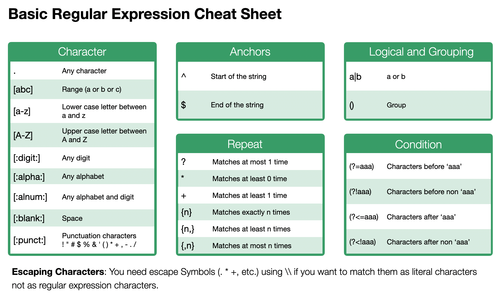

# Regular Expression

You can use the regular expression inside the Text Data Wrangling UI. The regular expression is a way to express a pattern of text with a combination of symbols so that you can extract / remove / replace a part of text data in a flexible way.

## Regular Expression Cheat Sheet

Most commonly used regular expressions are summarized in the sheet below.

