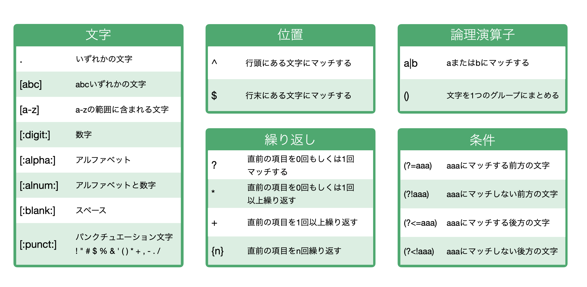

# 正規表現

テキストデータを加工する際、「正規表現」を使うことができます。「正規表現」とはある特定の文字列のパターンを記号などを使って表す手法のことです。

## 正規表現のチートシート

よく使われる正規表現を以下にまとめています。

詳細に関してはこちらのノートをご参照ください。

* [正規表現の使い方](https://exploratory.io/note/exploratory/cVi5Kwg7)
