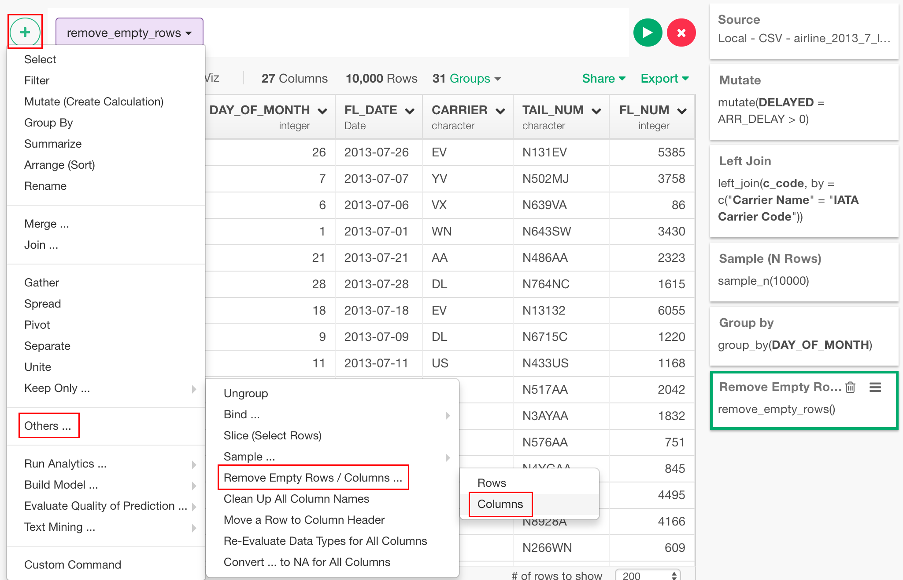

# Remove Empty Columns
Removes all columns from a data frame that are composed entirely of NA values.

## How to Access This Feature

### From + (plus) Button

* Click "+" button and select "Group By".
