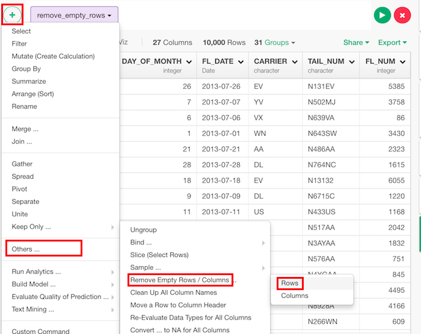

# Remove Empty Rows
Removes all rows from a data frame that are composed entirely of NA values.

## How to Access This Feature

### From + (plus) Button

* Click "+" button and select "Others... -> Remove Empty Rows / Columns -> Rows".
