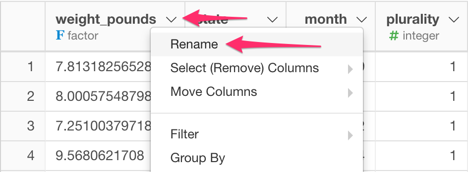

# Rename
Rename existing column names

## How to Access This Feature

### From + (plus) Button

* Click "+" button and select "Rename".

### From Column Menu

* You can also select "Rename" from column menu of the column to rename.

## Rename

2. Type in the new name for the column in "New Column Name" field.
3. Click "Run" to rename the column.
