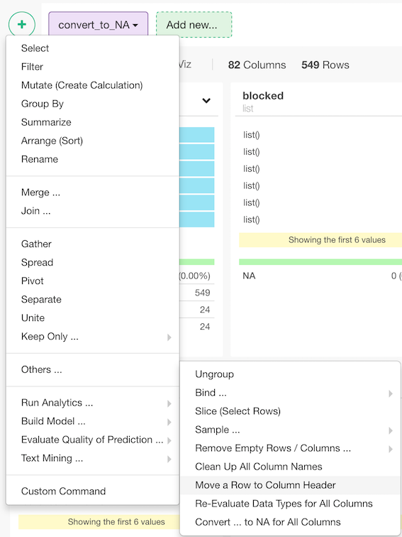
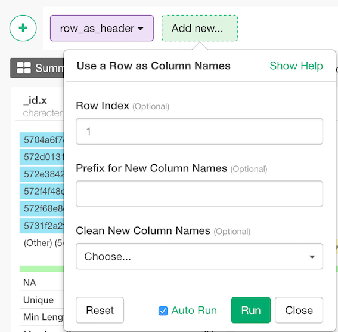

# Row as Header
Use a row as column names.

## How to Access This Feature

### From + (plus) Button

* Click "+" button and select "Other" - > "Convert ... to NA for All Columns"

## Use a row as column names

1. Row Index (Optional) - The default is 1. Index of a row to use as column names.
2. Prefix for New Column Names - The default is "". Prefix for the new column names.
3. Clean New Column Names - The default is TRUE. If TRUE, column names are cleaned by only underscore, lowercase letters, and numbers (same logic as clean_names from janitor package).
