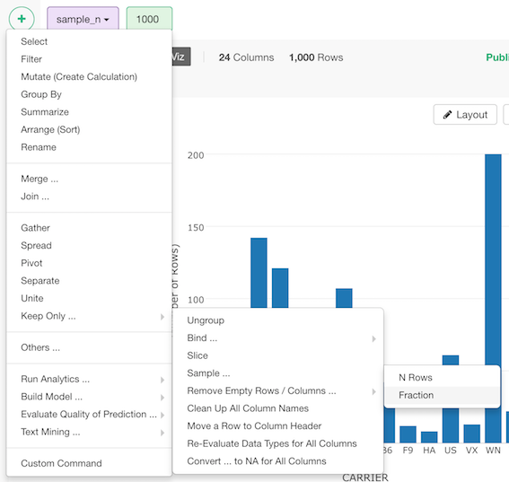
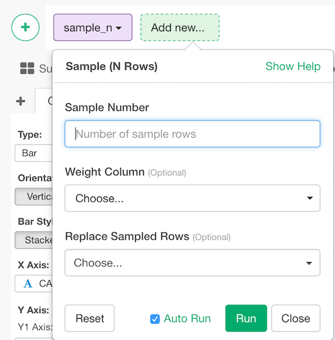
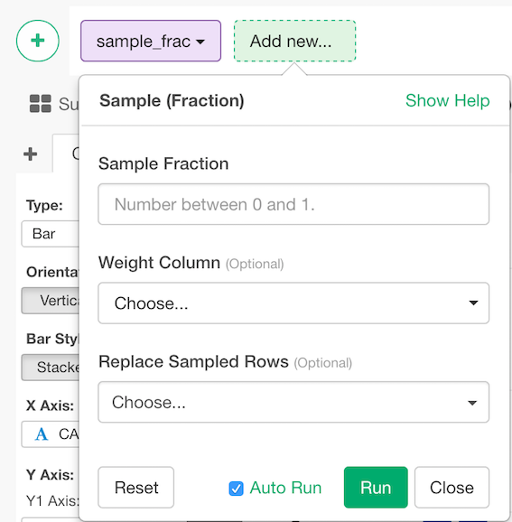

# Sample

## How to Access This Feature

### Sample (N Rows)
* Click "+" button and select "Others ..." -> "Sample ..." -> N Rows 

### Sample (Fraction)

* Click "+" button and select "Others ..." -> "Sample ..." -> Fraction

## Sample (N Rows)

1. Enter Sample Number - Number of rows you want to sample the data. (e.g. 10000)
2. Select `Weight Colulmn` (Optional) - Sampling weight. The ratio of probability the row should be chosen. This should be non-negative numeric vector whose size is the number of rows. It's normalized so that the sum of the probability will be 1.
3. Replace Sampled Rows (Options) - The default is FALSE. If it's TRUE, replacement will be executed when sampling.
3. Click "Run" to Sample data frame.

## Sample (Fraction)

1. Enter Sample Fraction ratio. It should be a numeric value between 0 and 1. (e.g. 0.4)
2. Select `Weight Colulmn` (Optional) - Sampling weight. The ratio of probability the row should be chosen. This should be non-negative numeric vector whose size is the number of rows. It's normalized so that the sum of the probability will be 1.
3. Replace Sampled Rows (Options) - The default is FALSE. If it's TRUE, replacement will be executed when sampling.
3. Click "Run" to Sample data frame.
