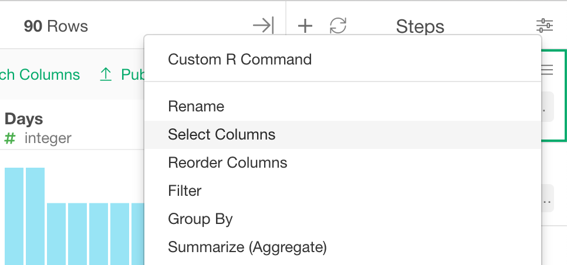
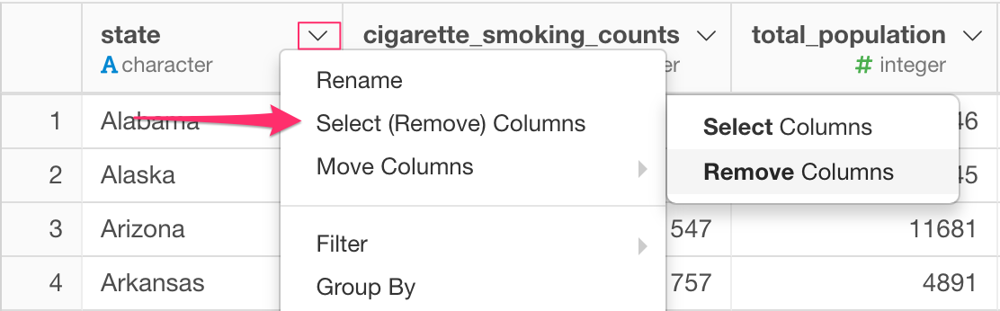

# Select / Remove Columns
Select / Rename column(s) by column names or by rule.

## How to Access This Feature

### From + (plus) Button

* Click "+" button and select "Select".

### From Column Menu

* You can also select "Keep / Drop" from column menu of the columns that you want to keep (or drop).

## Select / Remove Columns by Manually Specifying Columns

1. Select "Include" or "Exclude" depending on whether you are selecting (Include) or removing (Exclude) columns.
2. Click the column you want to select/remove.

## Select / Remove Columns by Rules

1. Select "Include" or "Exclude" depending on whether you are selecting (Include) or removing (Exclude) columns.
2. Click "Rule" tab.
3. Specify detail of the rule in the form that appears.
