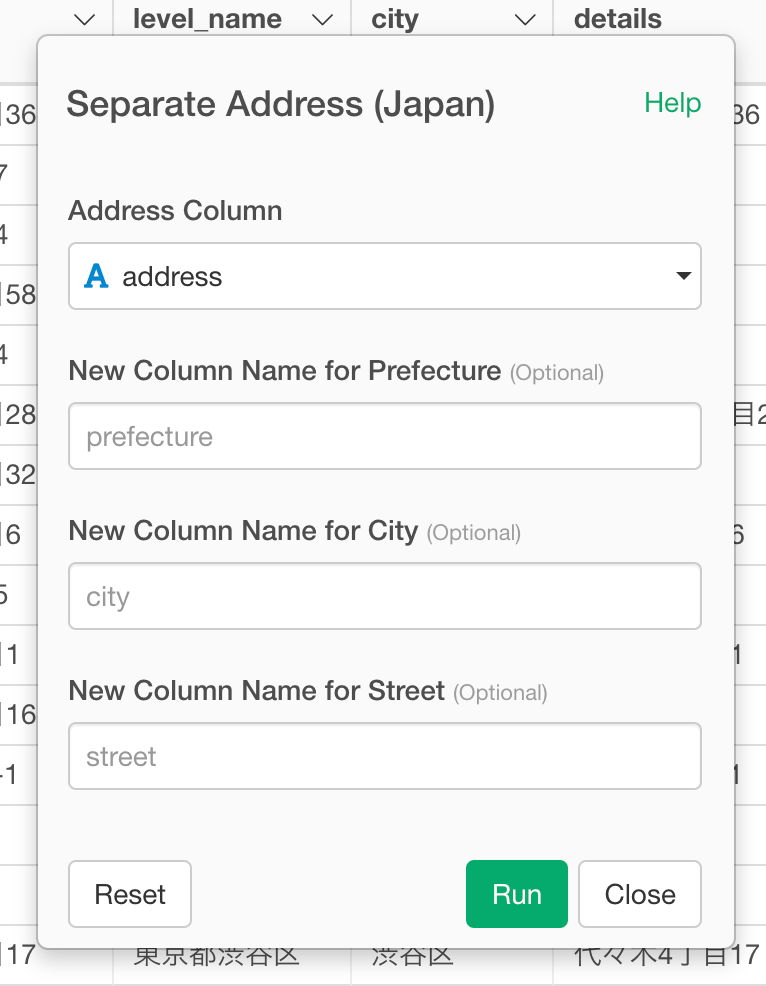

# Separate Address (Japan)

Separate Japanese address into prefecture, city, and street columns

## How to Access This Feature

### From Column Menu

## Separate Address (Japan) Dialog

Click Run button then it will create new columns (prefecture, city, and street) as follows:

