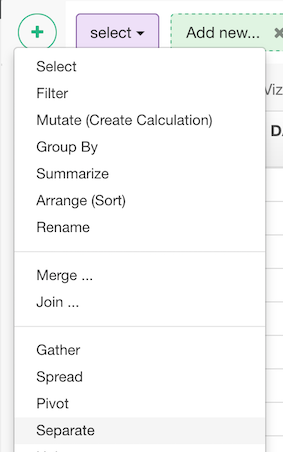
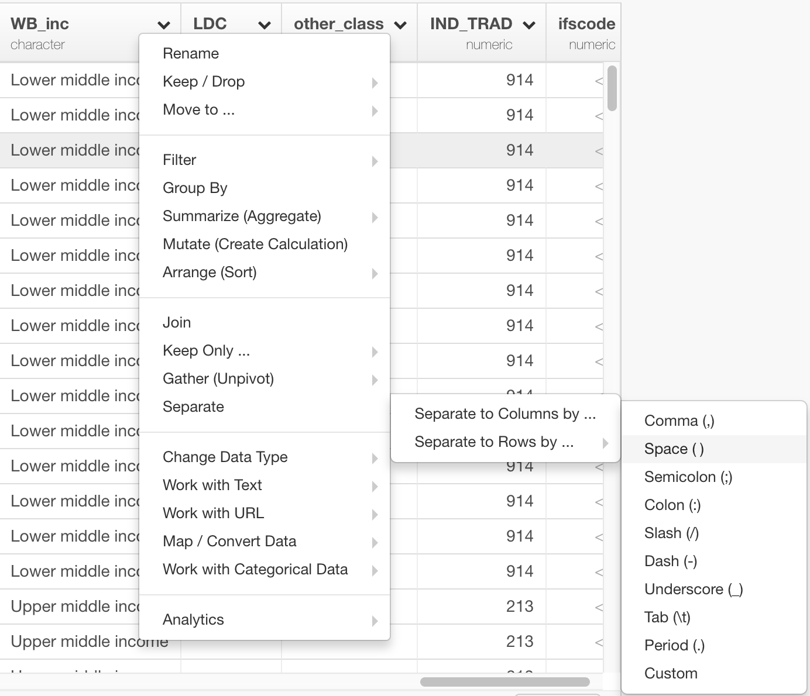
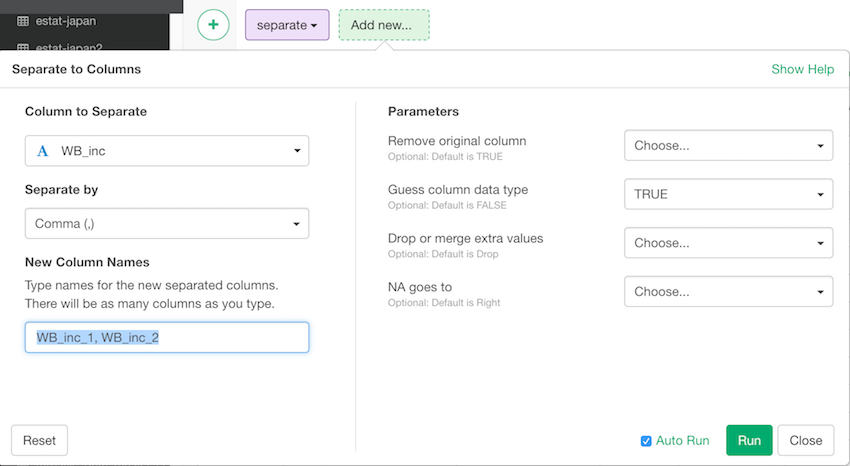

# Separate
Separates a column with delimited values into multiple columns

## How to Access This Feature

### From + (plus) Button

* Click "+" button and select "Separate".

### From Column Menu

* You can also select "Separate" from the column menu of the column to separate.

## Separate a Column with a Separating Text into Multiple Columns

1. Select column to separate from "Column to Separate" dropdown.
2. Specify separating text by selecting one from "Separate by" dropdown.
3. Specify names of resulting new columns, separated by comma, in "New Column Names" text field.
4. Specify parameters in the "Parameters" section.
  * Remove original column - The default is TRUE. Set FALSE to drop the original columns.
  * Guess column data type - The default is FALSE. Set TRUE to automatically guess the most possible data type for the columns in the result.
  * Drop or merge extra values - The default is "warn". Set "drop" to drop any text beyond the number of the new columns, "merge" to merge the text with the value in the last column.
  * NA goes to - You can control what happens when there are not enough pieces. Leaving it "Choose..." fills from the right. "Right" fills with missing values on the right. "Left" fills with missing values on the left.
5. Click "Run".
