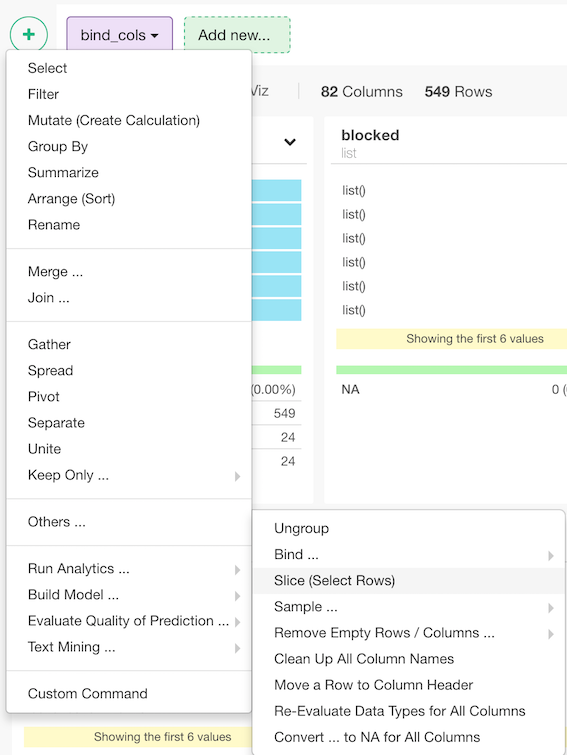
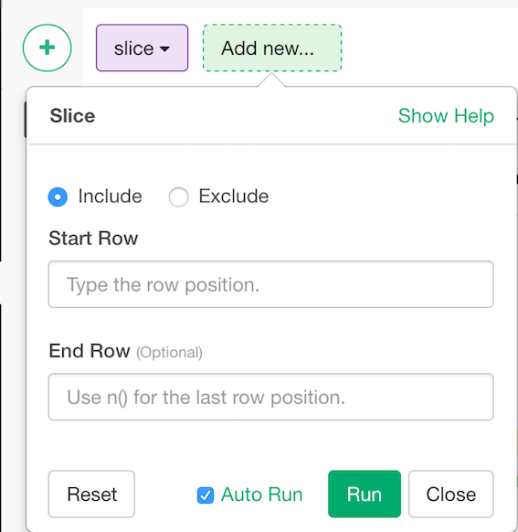

# Slice
Select rows by positions. This is not supported for relational databases, in which case you should use filter() with row_number() function.

## How to Access This Feature

### From + (plus) Button

* Click "+" button and select "Other" - > "Slice(Select Rows)"

## Bind multiple data frames by row

You can select rows by specifying start and end row position.
1. Start Row - Start Row position. for example, if you want to select rows from second row to fifth row, set 2 as Start Row.
2. End Row - End Row position. if you want to select from rows from second row to fifth row, set 5 as End Row. If you select from second row to last. You can set `n()` for End Row.
