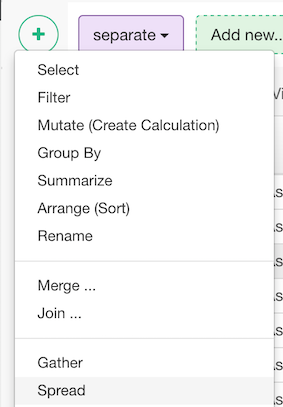
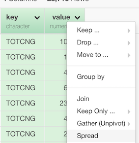

# Spread (Pivot)
Spread a key-value pair across multiple columns. Missing values will be replaced with NA.

## How to Access This Feature

### From + (plus) Button

* Click "+" button and select "Spread (Pivot)".

### From Column Menu

* You can also select two columns for key/value first, and then select "Spread (Pivot)" from the column menu of one of the selected columns.

## Spread (Pivot) a Key/Value Column Pair across Multiple Columns

1. Select Columns to Spread
  * Select Key/Value Columns from "Key Column"/"Value Column" dropdown.
2. Specify parameters in the "Parameters" section.
  * Fill NA with - Value to fill missing values.
  * Guess column data type - Select TRUE to automatically guess the most possible data type for the key column.
  * Drop empty columns - The default is TRUE. Set FALSE to keep the levels that don’t appear in the data, filling in missing combinations with the text set with 'Fill NA with' field.
  * Column Names Separator - The default is NULL. If NULL, the column names are values of the key column. Set separator text to make the column names "{key_column_name}{separator}{key_value}".
3. Click "Run".
