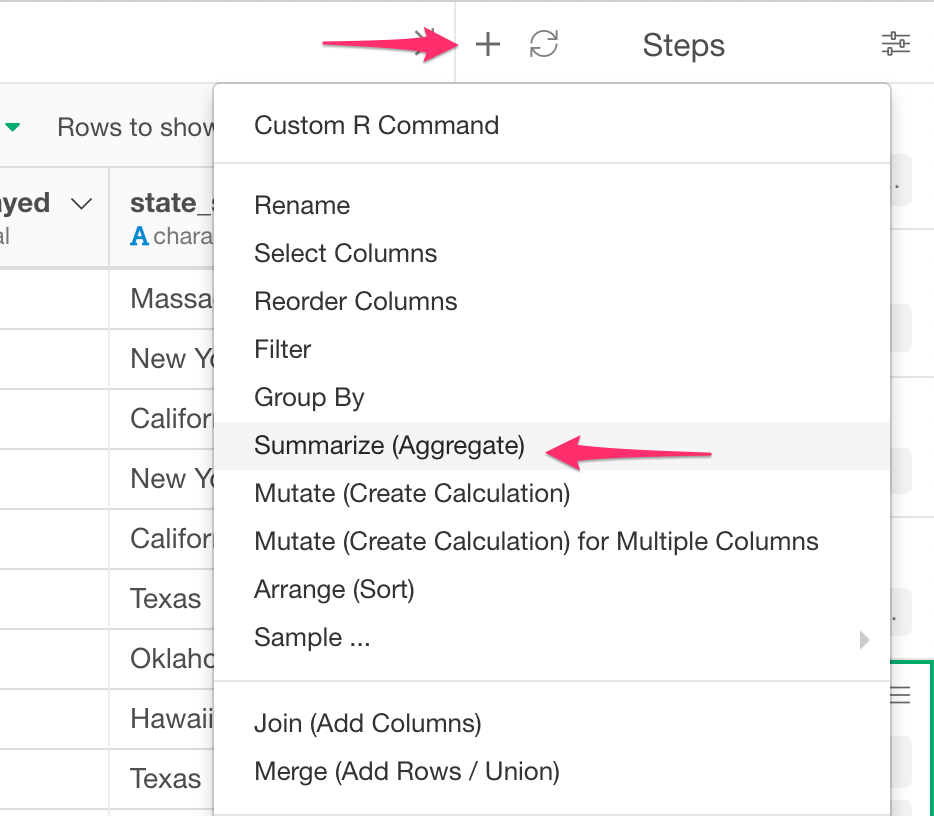
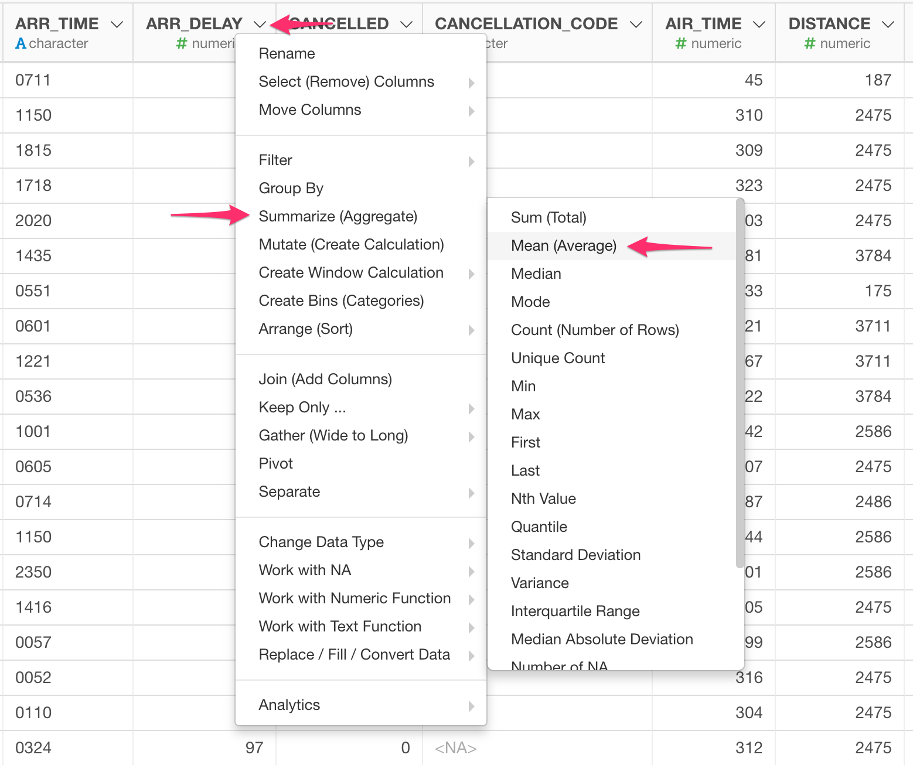
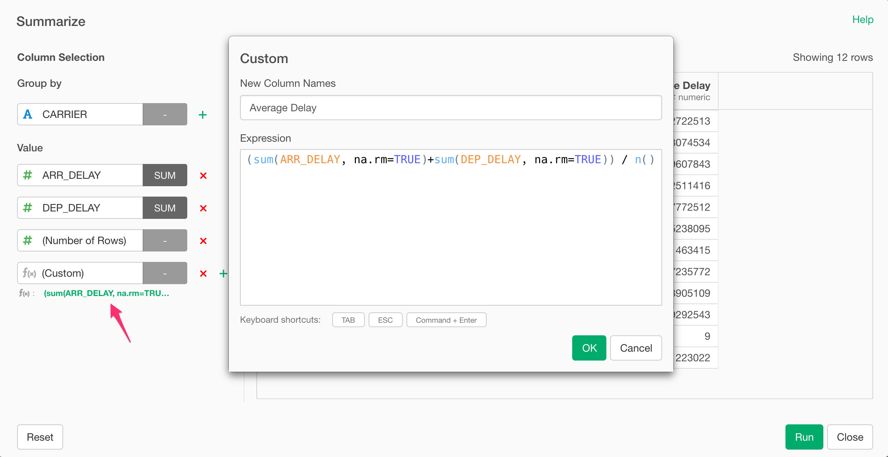

# Summarize (Aggregate)

## How to Access This Feature

### From + (plus) Button

* Click "+" button and select "Summarize (Aggregate)".

### From Column Menu

* You can also select "Summarize (Aggregate)" from column menu of the column to aggregate, and then select its submenu to choose the type of aggregation.

## Summarize by Selecting Aggregate Function from UI

1. (Optional) Select column(s) for "Group By".
2. Select Value column(s) to to aggregate its values.
3. Select aggregate function to apply to each column.
5. Click "Run" to run the aggregation and create the new column.

## Summarize by Custom R Expression

1. Select "(Custom)" from a Column List of Values.
2. On the Custom Dialog, type in the R Expression for the aggregation in "Expression" field.
3. Type in the name of new column with aggregation result in "New Column Name" field.
4. Click "OK" to run the aggregation and check the preview result.
5. Click "Run" to run the aggregation and create the new column.
