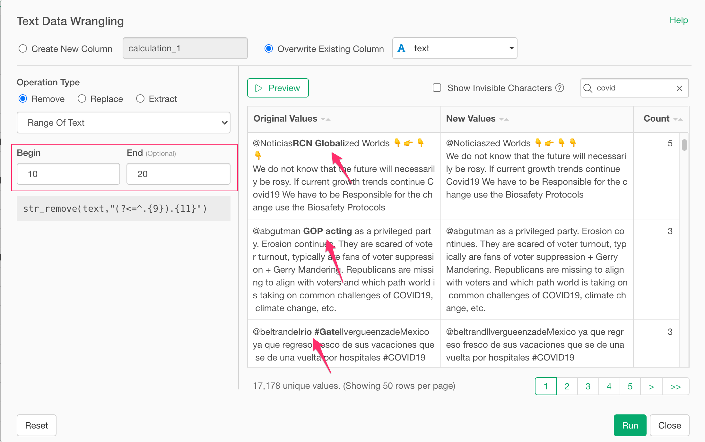
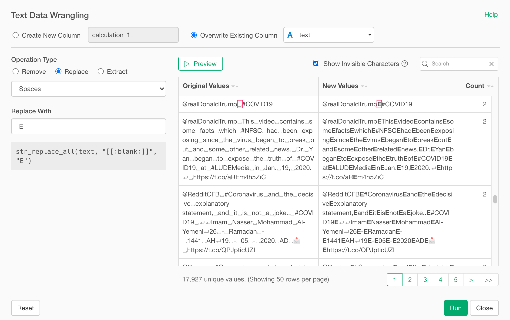
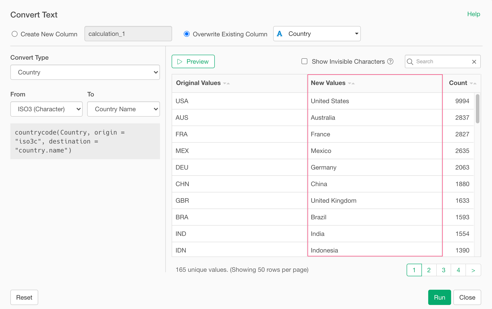

# Text Wrangling UI

With the Text Wrangling UI, you can remove, replace, and extract strings from your text data. 

## Remove
You can remove strings from your text data with various options listed below.

- Text
- Text (All)
- Text (Multiple Candidate)
- Text (Multiple Candidates: All)
- Text Inside Special Characters
- Text Inside Special Characters (All)
- Range of Text
- Alphabets
- Numbers
- First Word
- Last Word
- Spaces
- Repeated Spaces (Including Tabs and Line Breaks)
- Leading & Trailing Spaces
- Email Address
- URL
- Emoji
- Punctuations Characters

### How to Use 

You can access Text Wrangling UI Remove option from the column header menu. 

### Text

Type in strings that you want to remove from your text. In the below example, it removes "COVID19" from the text. 

#### Regular Expression

You can use regular expression to remove strings from your text. Click the Regular Expression radio button and type in a regular expression that you want to try. In the below example, it removes the "pandemic" at the end of the text.

#### Ignore Case

If you select "Yes" for Ignore Case radio button, it removes string with case insensitive fashion. For example, in the below example, it removes both 'pandemic' and 'Pandemic'.

#### Position

In the above regular expression case, you used `$` to match the string at the end. But you can do it without manually writing regular expression by selecting "end" for the `Position` parameter.

### Text (All)

It's basically same as "Text" option. The difference is it removes the all the matches. In below example, there are two "Pandemic" in the text and both of them are removed. In case of "Text", it only removes the first match.

### Text (Multiple Candidates)

This option removes strings using multiple candidates for matching. In below example, it removes strings that match either "pandemic" or "covid".

### Text (Multiple Candidates: All)

It's basically same as Text (Multiple Candidates). The difference is it removes all the matches like the below screenshot.

### Text Inside Special Characters

This option removes text inside specified special characters. It's useful when you want to remove text inside parentheses. If you select "Include Special Characters", it removes the text along with begin and end special characters.

### Text Inside Special Characters (All)

It's basically the same as Text Inside Special Characters. The difference is it removes all the matches in the text like the below screenshot.

### Range of Text

This option removes strings in a specified range from your text. The below example shows removing strings between 10th and 20th.

### Alphabets

This option removes Alphabets from your text like the below screenshot.

### Numbers

This option removes Numbers from your text like the below screenshot.

### First Word

This option separate text into words with specified separator (space for the below example) and removes the first word like the below screenshot. 

### Last Word

This option separate text into words with specified separator (space for the below example) and removes the last word like the below screenshot. 

### Spaces

This option removes spaces in the text like below screenshot. By clicking "Show Invisible Characters" checkbox, you can see space with "␣" character in the preview table.

### Repeated Spaces (Including Tabs and Line Breaks)

This option removes repeated spaces, tabs, and line breaks. In the below example, you can see double spaces are changed to single space and line breaks are removed.

### Leading & Trailing Spaces

This option removes leading and trailing spaces. For example, in the below screenshot shows the case where the "Japan" has trailing space and it removes the trailing space.

### Email Address

This option removes email addresses from your text like below screenshot.

### URL

This option removes URLs from your text like below screenshot.

### Emoji

This option removes Emojis from your text like below screenshot.

### Punctuations Characters

This option removes Punctuation Characters from your text like below screenshot.

## Replace

You can replace strings from your text data with various options listed below.

- Text
- Text (All)
- Text (Multiple Candidate)
- Text (Multiple Candidates: All)
- Text Inside Special Characters
- Text Inside Special Characters (All)
- Range of Text
- Alphabets
- Numbers
- First Word
- Last Word
- Spaces
- Email Address
- URL
- Punctuations Characters

### How to Use 

You can access Text Wrangling UI Replace option from the column header menu. 

### Text

Type in strings that you want to replace. In the below example, it replaces "COVID19" with "Corona Virus".

#### Regular Expression

You can use regular expression to replace strings in your text. Click the "Regular Expression" radio button and type in a regular expression that you want to try. In the below example, with the regular expression it can replace the strings like "New York" to NYC.

#### Ignore Case

If you select "No" for Ignore Case radio button, it replaces string with case sensitive fashion. For example, in the below example, it replace 'new York' but not 'New York'.

#### Position

If you select the "End" for the Position, it only matches the string at the end of the text. In the below example, it only matches "COVID19" at the end of the text and ignore the rest.

### Text (All)

It's basically same as "Text" option. The difference is it replaces the ALL the matches. In below example, there are two "new" in the text and both of them are replaced with "NEW". In case of "Text", only the first one got replaced.

### Text (Multiple Candidates)

This option replace strings using multiple candidates for matching. In below example, it replaces strings that match either "covid" or "corona" to "New". You can enter comma separate values to the From input field as candidates. 

### Text (Multiple Candidates: All)

It's basically same as Text (Multiple Candidates). The difference is it replaces all the matches like the below screenshot.

### Text Inside Special Characters

This option replaces text inside specified special characters with the value entered in "Replace With" input field. It's useful when you want to replace text inside parentheses. If you select No for "Include Special Characters", it keeps the begin and end special characters and replace strings inside of these.

### Text Inside Special Characters (All)

It's basically the same as Text Inside Special Characters. The difference is it replaces all the matches in the text like the below screenshot.

### Range of Text

This option replaces strings in a specified range in your text with the value entered in "Replace With" input field. The below example shows replacing strings between 10th and 20th with "Special".

### Alphabets

This option replaces Alphabets in your text with the value entered in "Replace With" input field like the below screenshot.

### Numbers

This option replaces Numbers in your text like the below screenshot.

### First Word

This option separate text into words with specified separator (space for the below example) and replaces the first word like the below screenshot. 

### Last Word

This option separate text into words with specified separator (space for the below example) and replaces the last word like the below screenshot. 

### Spaces

This option replaces spaces in the text like below screenshot. By clicking "Show Invisible Characters" checkbox, you can see space with "␣" character in the preview table.

### Email Address

This option replaces email addresses in your text like below screenshot.

### URL

This option replaces URLs in your text like below screenshot.

### Punctuations Characters

This option replaces Punctuation Characters in your text like below screenshot.

## Extract

You can replace strings from your text data with various options listed below.

- Text
- Text (All)
- Text (Multiple Candidate)
- Text (Multiple Candidates: All)
- Text Inside Special Characters
- Text Inside Special Characters (All)
- Range of Text
- Alphabets
- Numbers
- First Word
- Last Word
- Nth Word (2nd, 3rd, etc.)
- Email Address
- URL

### How to Use 

You can access Text Wrangling UI Extract option from the column header menu. 

### Text

Type in strings that you want to replace. In the below example, it extracts "COVID" from text.

#### Regular Expression

You can use regular expression to replace strings in your text. Click the "Regular Expression" radio button and type in a regular expression that you want to try. In the below example, with the regular expression it can extracts the strings like "New York".

#### Ignore Case

If you select "No" for Ignore Case radio button, it extracts string with case sensitive fashion. For example, in the below example, it extracts 'new York' but not 'New York'.

#### Position

If you select the "End" for the Position, it only matches the string at the end of the text. In the below example, it only matches "COVID19" at the end of the text and ignore the rest.

### Text (All)

It's basically same as "Text" option. The difference is it extracts the ALL the matches. In below example, there are two "new" in the text and both of them are replaced with "NEW". In case of "Text", only the first one got replaced.

### Text (Multiple Candidates)

This option extracts strings using multiple candidates for matching. In below example, it extracts strings that match either "covid" or "corona" to "New". You can enter comma separate values to the From input field as candidates. 

### Text (Multiple Candidates: All)

It's basically same as Text (Multiple Candidates). The difference is it extracts all the matches like the below screenshot.

### Text Inside Special Characters

This option extracts text inside specified special characters. It's useful when you want to extract text inside parentheses.

### Text Inside Special Characters (All)

It's basically the same as Text Inside Special Characters. The difference is it extracts all the matches in the text like the below screenshot.

### Range of Text

This option extracts strings in a specified range from your text. The below example shows extracting strings between 10th and 20th.

### Alphabets

This option extracts Alphabets from your text like the below screenshot.

### Numbers

This option extracts Numbers from your text like the below screenshot.

### First Word

This option separates text into words with specified separator (space for the below example) and extracts the first word like the below screenshot. 

### Last Word

This option separates text into words with specified separator (space for the below example) and extracts the last word like the below screenshot. 

### N th Word

This option separates text into words with specified separator (space for the below example) and extracts the nth word (e.g. 2nd word) like the below screenshot. 

### Email Address

This option extracts email addresses in your text like below screenshot.

### URL

This option extracts URLs in your text like below screenshot.

## Convert

You can replace strings from your text data with various options listed below.

- UPPERCASE
- lowercase
- Title Case
- Normalize (Zenkaku/Hankaku)
- Country
- US State
- US County
- IP Address - Country
- Anonymize
- Detect a Given Text (TRUE/FALSE)
- Character Encoding

### How to Use 

You can access Text Wrangling UI Extract option from the column header menu. 

### UPPERCASE

It converts text to uppercase like the below screenshot.

#### lowercase

It converts text to lowercase like the below screenshots.

#### Title Case

If you select "No" for Ignore Case radio button, it extracts string with case sensitive fashion. For example, in the below example, it extracts 'new York' but not 'New York'.

#### Normalize (Zenkaku/Hankaku)

It normalize text. In the below example, it converts Zenakaku numbers Hankaku numbers.

### Country

You can convert country code to country name or vice versa.
The supported country codes are:

- Correlates of War (Character)
- Correlates of War (Numeric)
- ISO3 (Character)
- ISO3 (Numeric)
- ISO2 (Character)
- IMF (Numeric)
- FIPS (ederal Information Processing Standard) 10-4 (Numeric)
- FAO (Numeric)
- United Nations (Numeric)
- Word Bank (Character)

### US State

It converts US State code to US State Name or vice versa.
The supported US State codes are:

- US States Abbreviation
- US States Number

Also, you can convert US state to Division like "Pacific", "Middle Atlantic", etc. or to Region like "West", "Northeast", etc.

### US County

It generates US county code (FIPS - Federal Information Processing Standard) based on US State and County names. To use this operation, you need to specify the column includes US State Names for the US County.

### IP Address - Country

It converts IP address to country name.

### Anonymize

it anonymizes values by hashing algorithms.

### Detect a Give Text (TRUE/FALSE)

it returns TRUE or FALSE based on whether Text data contains a given text or not.

### Character Encoding

It converts column character encoding. Below example, converts encoding from Japanese cp932 to UTF-8.

