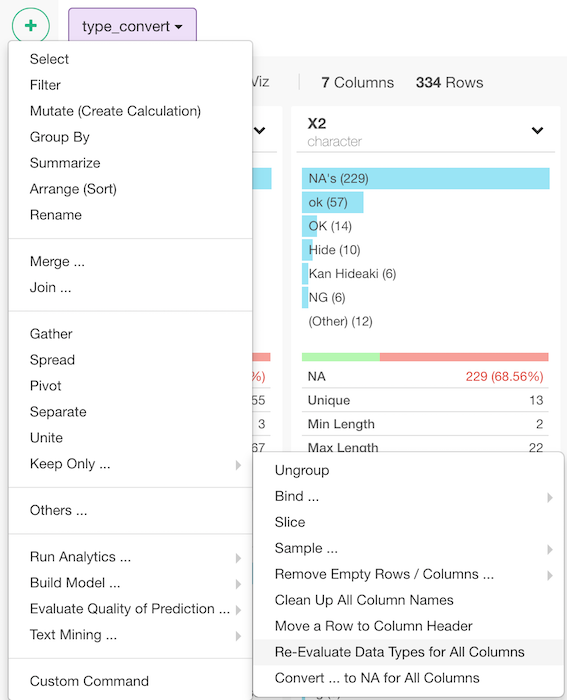
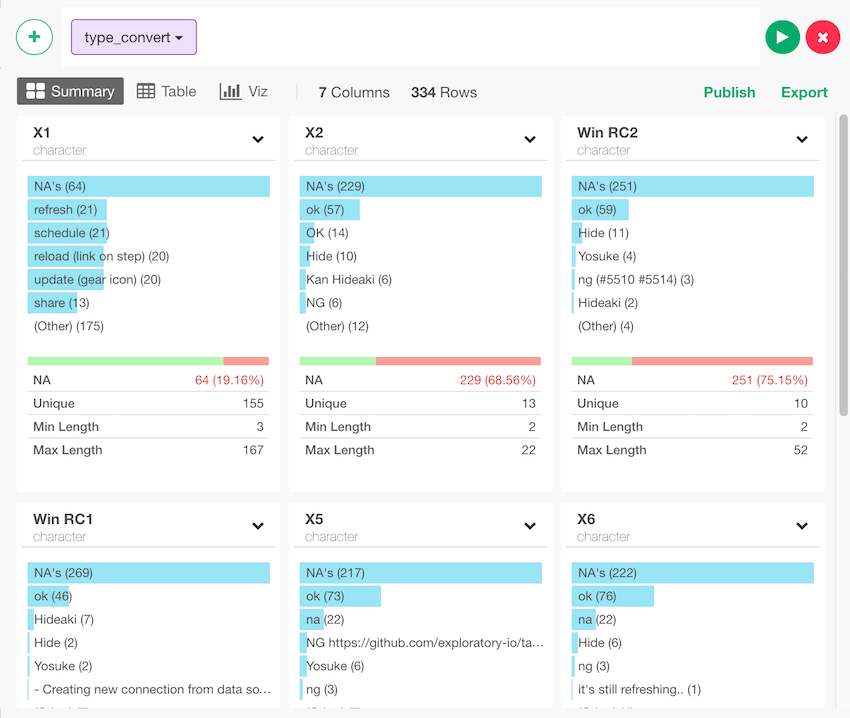

# Type Convert

Heuristically guess the data type for each column by reading the first 1000 rows, parse the data, and set appropriate data types for all the columns of the data frame

## How to Access This Feature

Click "+" button and select "Others ..." -> "Re-Evaluate Data Types for All Columns" 

## Type Convert

No arguments to enter. It automatically executes the command.
