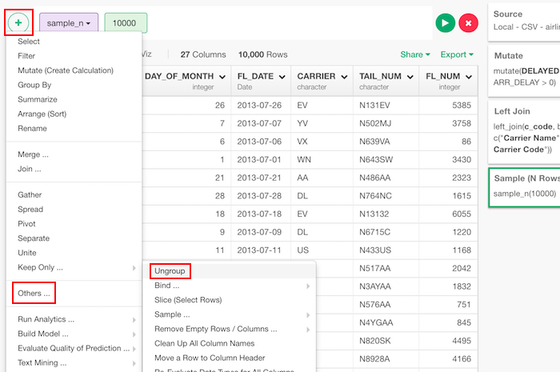
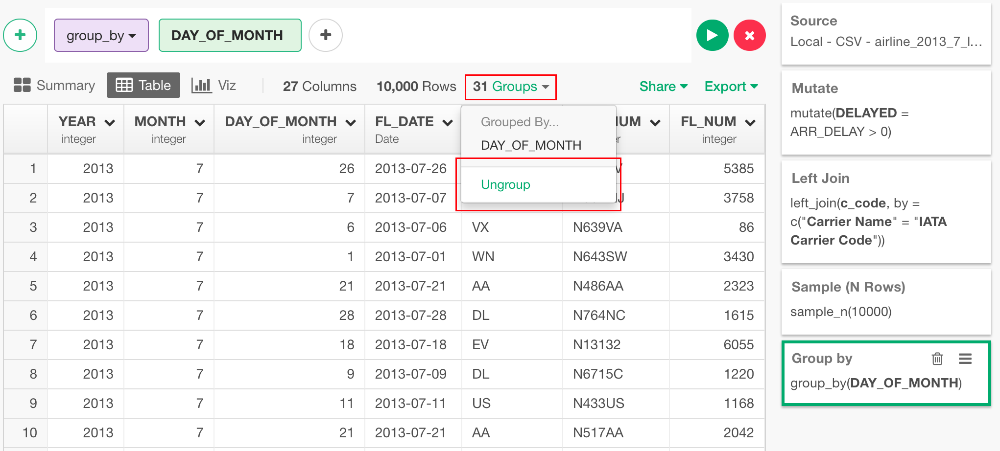

# Ungroup
Converts the data frame into a grouped data frame where the following operations will be performed based on the groups. Grouping should be done before you want to aggregate values.

## How to Access This Feature

### From + (plus) Button

* Click "+" button and select "Group By".

### From Group Menu

* You can also click "Ungroup" from the group dropdown menu.
