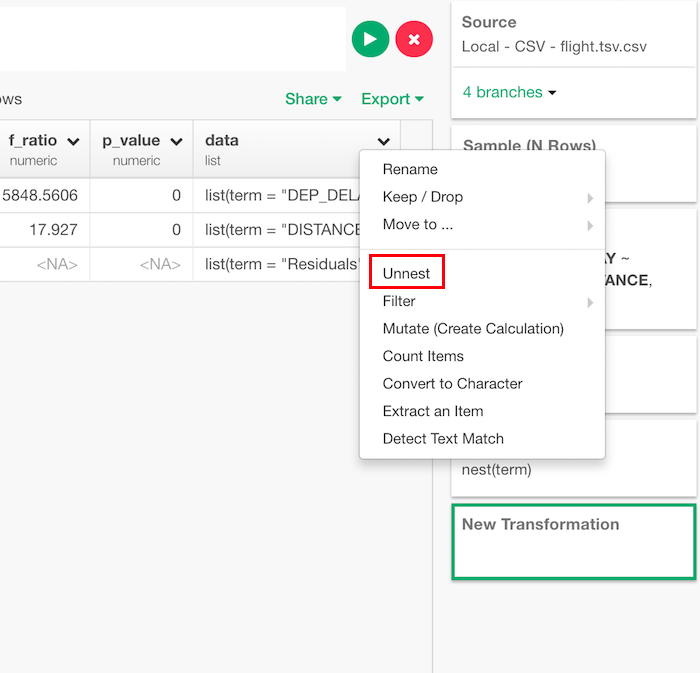

# Unnest

Unnest a list column or a list of data frames by making each element of the list to be presented in its own row.

## How to Access This Feature

You can access it from column menu of list columns.

## Unnest

* Drop other list columns (Optional) - The default is TRUE. Set whether the other list column(s) to be dropped or not.
Column Name Separator (Optional) - If this is used, it creates a new column of list keys, giving a unique identifer. This is most useful if the list column is named.
List Key Column Name (Optional) - If this is used, the names of unnested data frame columns are combined with list keys separated by the text.
